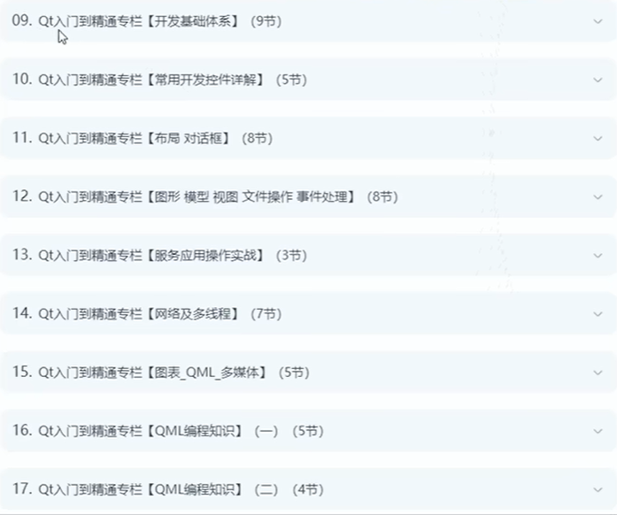

# 1.Qt开发岗位十大技术栈模块

## 1》c语言数据结构与算法模块

## 2》c++语言语法，新特性，stl与boost库

## 3》23种设计模式

## 4》Qt编程入门到精通

## 5》数据库编程，SQlite和MySQL

## 6》OpenGl和OpenCV高级编程

## 7》Qt网络编程和多线程编程

## 8》QtQuick高级编程

## 9》谷歌CEF编程技术

## 10》Qt Core和Qt GUI和研究Qt源码分析

# 2.项目实战开发经验

## 1》WPS文字处理软件/word/excel （用qt实现类似功能的软件）

## 2》mp3音乐播放器搜索引擎（qt6+SQlite)

## 3》库存管理系统（qt6+MySQL）

## 4》QQ客户端程序（c/s模式）

## 5》ffmpeg+Qt视频播放器

## 6》在线网盘系统客户端

