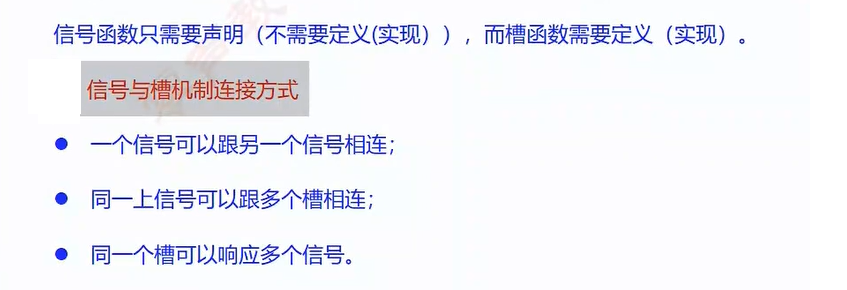
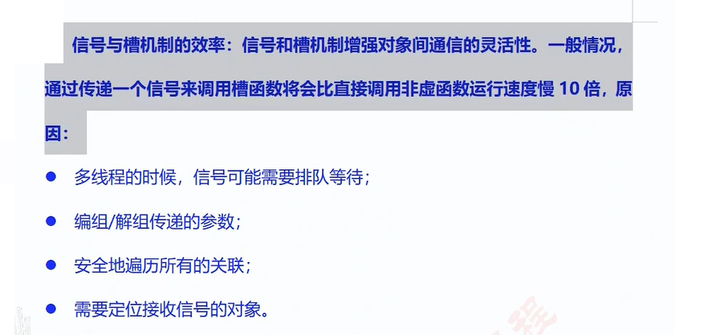
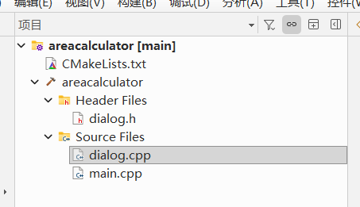
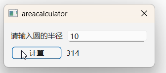

# 1.理解Qt的信号与槽

Qt信号与槽（Signals and Slots）是Qt框架的核心机制，用于实现对象间的解耦通信。简单来说，当某个特定事件发生时，一个对象会发出一个**信号**；如果另一个对象绑定了该信号对应的**槽函数**，系统就会自动调用该槽函数。 [[1](https://www.cnblogs.com/QG-whz/p/4995938.html), [2](https://developer.aliyun.com/article/1645640), [3](https://juejin.cn/post/6847902223691677703)]

它是`类型安全`的回调替代方案，具备以下关键特性： [[1](https://blog.csdn.net/qq_38072731/article/details/142488067)]

- **松散耦合**：发送者无需知道谁接收信号，接收者也无需知道谁发送信号。
- **多对多映射**：一个信号可绑定多个槽函数，一个槽也可监听多个信号。
- **跨线程通信**：自动处理线程同步，适合异步事件处理。 [[1](http://cppdebug.com/archives/541), [2](https://doc.qt.io/qt-6/zh/signalsandslots.html), [3](https://zhuanlan.zhihu.com/p/347456731), [4](https://developer.aliyun.com/article/1645640)]

一、 核心概念与工作流程

1. **信号 (Signals)**
   - 在类中声明，类似事件通知。
   - **只需声明，无需实现**（由Qt的Meta-Object Compiler自动生成底层代码）。
   - 返回值通常为 `void`，可以带有参数。 [[1](http://cppdebug.com/archives/541), [2](https://cloud.tencent.com/developer/article/2347808), [3](https://developer.aliyun.com/article/1645640)]
2. **槽 (Slots)**
   - 普通的C++成员函数。
   - **需要实现**，当信号触发时执行相应逻辑。 [[1](https://zhuanlan.zhihu.com/p/347456731), [2](https://cloud.tencent.com/developer/article/2347808), [3](https://juejin.cn/post/6847902223691677703)]
3. **连接 (Connect)**
   - 使用 `connect()` 函数将信号与槽绑定。
   - 当信号通过 `emit` 关键字发射时，绑定的槽函数将被调用。 [[1](http://cppdebug.com/archives/541), [2](https://zhuanlan.zhihu.com/p/347456731)]

二、 代码实现示例

以经典的“按钮点击导致窗口关闭”为例： [[1](https://doc.qt.io/qt-6/zh/signalsandslots.html)]

cpp

```
// 在头文件声明类
#include <QObject>
#include <QPushButton>
#include <QApplication>

class MyWidget : public QObject {
    Q_OBJECT // 必须包含该宏，启用Qt的元对象系统

public:
    MyWidget() {
        QPushButton *button = new QPushButton("Quit", nullptr);
        
        // 使用函数指针形式进行连接 (推荐自Qt 5起使用)
        // 语法：connect(发送者, &发送者类::信号, 接收者, &接收者类::槽);
        connect(button, &QPushButton::clicked, QApplication::quit);
        
        button->show();
    }
};
```

请谨慎使用此类代码。

三、 常见连接语法对比（Qt 5 与 Qt 6 推荐）

目前最推荐使用的是**基于函数指针（Function Pointer）的重载版本**，因为它能在编译期进行类型检查： [[1](http://cppdebug.com/archives/541)]

cpp

```
// 1. 发送者与接收者同为当前类
connect(sender, &SenderClass::mySignal, this, &ReceiverClass::mySlot);

// 2. 使用 Lambda 表达式处理（极度灵活）
connect(sender, &SenderClass::mySignal, this, [=]() {
    // 执行局部代码
});

// 3. 传统字符串形式（老版本常用，支持运行时检查）
connect(sender, SIGNAL(mySignal()), this, SLOT(mySlot()));
```


四、 信号与槽的连接类型（Connection Types）

通过 `connect` 的第五个参数，可以控制信号触发时的响应方式和线程行为： [[1](http://cppdebug.com/archives/541)]

| 连接类型 [[1](http://cppdebug.com/archives/541), [2](https://zhuanlan.zhihu.com/p/678443355)] | 描述                                                         |
| ------------------------------------------------------------ | ------------------------------------------------------------ |
| **Qt::AutoConnection**                                       | （默认）如果信号和槽在同一线程，等同于 `DirectConnection`；若在不同线程，等同于 `QueuedConnection`。 |
| **Qt::DirectConnection**                                     | 信号发射时立即同步调用槽函数，槽函数在**信号发送线程**中直接执行。 |
| **Qt::QueuedConnection**                                     | 信号发射后放入接收线程的事件队列，由接收线程的事件循环稍后处理。 |
| **Qt::BlockingQueuedConnection**                             | 类似 `QueuedConnection`，但发送线程会阻塞，直到接收线程执行完槽函数（跨线程慎用，容易死锁）。 |
| **Qt::UniqueConnection**                                     | 防止重复连接。若已存在相同的连接，则 `connect` 失败。        |

五、 底层原理 (元对象系统 Meta-Object System)

信号与槽机制之所以强大，依赖于三个核心组件：

1. **`Q_OBJECT` 宏**：类定义中必须包含它。
2. **MOC (Meta-Object Compiler)**：预处理器，读取C++头文件，识别 `signals` 和 `slots`，并生成包含反射信息和绑定逻辑的额外C++源文件（通常为 `moc_*.cpp`）。
3. **Qt 事件循环**：对于跨线程或排队的信号调用，槽函数的执行依赖于事件循环（Event Loop）来派发任务。 [[1](https://zhuanlan.zhihu.com/p/678443355), [2](http://cppdebug.com/archives/541)]

六、 使用注意事项

- **必须继承QObject**：包含信号和槽的类必须直接或间接继承自 `QObject`。
- **形参匹配规则**：信号和槽的参数类型和个数必须一致。槽函数的参数可以少于信号的参数，但多余的参数会被忽略。
- **断开连接**：使用 `disconnect()` 函数可以解除绑定，防止内存泄漏或不再需要的触发。

# 2.信号和槽的特点



# 3.信号与槽机制的效率



# 4.小项目：计算圆的面积，采用纯手写代码



## 1》main.cpp是项目启动文件，这里可以不管。我们只需要处理Dialog.cpp,main.cpp的代码如下

```
#include "dialog.h"

#include <QApplication>

int main(int argc, char *argv[])
{
    QApplication a(argc, argv);
    Dialog w;
    w.show();
    return a.exec();
}

```

## 2>dialog.h的代码如下

```
#ifndef DIALOG_H
#define DIALOG_H

#include <QDialog>

class Dialog : public QDialog
{
    Q_OBJECT

public:
    Dialog(QWidget *parent = nullptr);
    ~Dialog();
};
#endif // DIALOG_H

```


## 3> dialog.cpp的代码如下

```
#include "dialog.h"
#include<QLabel>
#include<QLineEdit>
#include<QPushButton>
#include<QGridLayout>

Dialog::Dialog(QWidget *parent)
    : QDialog(parent)
{
    QLabel* plbl1 = new QLabel("请输入圆的半径",this);
    QLabel* presult = new QLabel("",this);
    QLineEdit *pedit = new QLineEdit(this);
    QPushButton* pbtn = new QPushButton("计算",this);
    QGridLayout * playout = new QGridLayout(this);
    playout->addWidget(plbl1,0,0);
    playout->addWidget(pedit,0,1);
    playout->addWidget(pbtn,1,0);
    playout->addWidget(presult,1,1);
    QObject::connect(pbtn,&QPushButton::clicked,this,[=](){
        int r = pedit->text().toInt();
        double result = 3.14 * r * r;
        presult->setText(QString::number(result));
    });
}

Dialog::~Dialog()
{
}


```

## 效果



### 知识点：double类型转化为QString

  ```     
   double result = 3.14 * r * r;
   presult->setText(QString::number(result));
  ```

## 我们还可以改进一下，绑定第二个事件，就编辑框的文本改变事件，修改后dialog.cpp代码如下

```
#include "dialog.h"
#include<QLabel>
#include<QLineEdit>
#include<QPushButton>
#include<QGridLayout>
#include<QMessageBox>

Dialog::Dialog(QWidget *parent)
    : QDialog(parent)
{
    QLabel* plbl1 = new QLabel("请输入圆的半径",this);
    QLabel* presult = new QLabel("",this);
    QLineEdit *pedit = new QLineEdit(this);
    QPushButton* pbtn = new QPushButton("显示结果",this);
    QGridLayout * playout = new QGridLayout(this);
    playout->addWidget(plbl1,0,0);
    playout->addWidget(pedit,0,1);
    playout->addWidget(pbtn,1,0);
    playout->addWidget(presult,1,1);
    QObject::connect(pbtn,&QPushButton::clicked,this,[=](){
        // int r = pedit->text().toInt();
        // double result = 3.14 * r * r;
        // presult->setText(QString::number(result));
        QMessageBox::information(nullptr,"result",presult->text());
    });

    QObject::connect(pedit,&QLineEdit::textChanged,this,[=](){
        int r = pedit->text().toInt();
        double result = 3.14 * r * r;
        presult->setText(QString::number(result));
    });

}

Dialog::~Dialog()
{
}


```

## 小技巧：Qt伙伴编辑模式（Buddy Editing Mode）

Qt伙伴编辑模式（Buddy Editing Mode）能把标签（`QLabel`）和输入框等控件连接起来。这样，当用户按下标签上的快捷键时，输入框就会自动获得焦点。

在 `Qt Designer` 中按 **F4** 键即可切换此模式。 [[1](https://www.cnblogs.com/suntroop/articles/18605783), [2](https://doc.qt.io/qt-6.8/zh/designer-editing-mode.html)]

操作步骤

1. 按下 **F4** 切换到伙伴编辑模式。
2. 点击一个标签（`QLabel`）并按住鼠标。
3. 拖动线条到对应的输入框（如 `QLineEdit`）上释放鼠标。
4. 标签文字需要包含“&”符号才能触发快捷键（例如：将文字设为 `&Name` 时，快捷键为 `Alt + N`）。 [[1](https://www.cnblogs.com/suntroop/articles/18605783), [2](https://doc.qt.io/qt-6.8/zh/designer-editing-mode.html)]

原理类比

就像是电灯开关和灯泡的关系。标签（开关）本身无法输入文字，但通过伙伴关系，标签可以将焦点“指引”给输入框（灯泡），让界面操作更高效。
