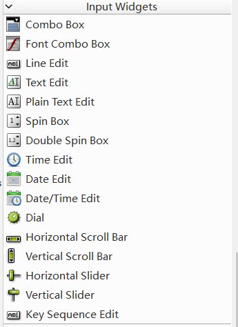
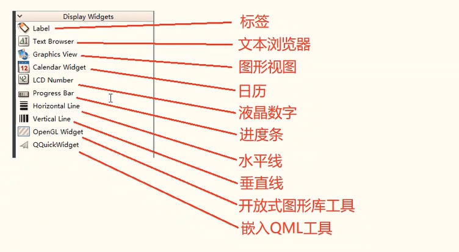
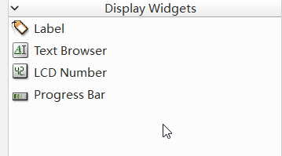
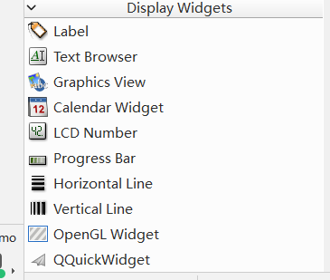
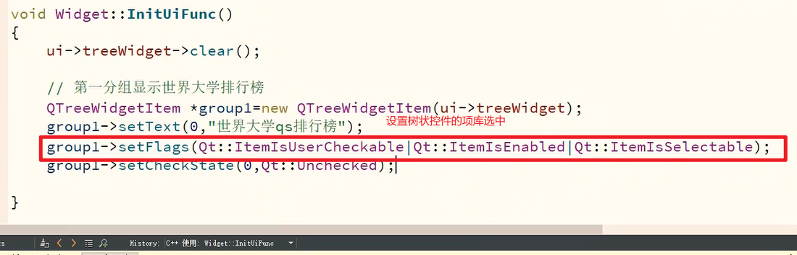

# 1.输入布局/显示控件组

#### 输入控件组





#### 显示控件组





### 配置树状控件




# 2.空间间隔/布局管理组

### 自己学习

# 3.容器组/项目视图组

### 自己学习

# 4.项目控件组/项目实战

### 自己学习


## 扩展，[24.PyQt5【高级组件】树形组件-QTreeWidget](https://www.cnblogs.com/ckxingchen/p/17054887.html)

一、**前言**

QTreeWidget 使用类似于 QListView 类的方式提供一种典型的基于 item 的树形交互方法类，该类基于QT的“模型/视图”结构，提供了默认的模型来支撑 item 的显示，这些 item 类为 QTreeWidgetItem 类。

二、**学习目标**

1.QTreeWidget常用方法

2.QTreeWidget常用信号

3.QTreeWidget组件的应用

三、**知识点**

**1.【QTreeWidget常用方法】**

- QTreeWidget类中的常用方法

  | 方法                              | 描述                                                       |
  | --------------------------------- | ---------------------------------------------------------- |
  | addTopLevelItem(item)             | QTreeWidget组件增加单个根节点item                          |
  | addTopLevelItems(items)           | QTreeWidget组件增加多个根节点item                          |
  | setHeaderLabels(labels)           | 设置标题列并为每个列设置标签                               |
  | setColumnWidth(column, num)       | 设置列宽                                                   |
  | setItemWidget(item,column,widget) | 为指定列的item设置小部件                                   |
  | removeItemWidget(item,column)     | 为指定列的item删除小部件                                   |
  | insertTopLevelItem(index,item)    | 在索引位置插入单个根节点                                   |
  | insertTopLevelItems(index,items)  | 在索引位置插入多个根节点                                   |
  | takeTopLevelItem(index)           | 删除指定索引位置的根节点                                   |
  | findItems(text,flags[,column=0])  | 使用给定的标志查找文本与字符串文本匹配的项目               |
  | currentItem()                     | 返回当前item对象                                           |
  | columnCount()                     | 返回所有列数                                               |
  | currentColumn()                   | 返回当前项的列索引                                         |
  | headerItem()                      | 返回标题项item对象                                         |
  | indexOfTopLevelItem(item)         | 返回给定根节点item的索引值                                 |
  | topLevelItem(index)               | 返回给定索引处的根节点item，如果该项目不存在，则返回None。 |
  | topLevelItemCount()               | 返回根节点item的数量。默认情况下，此属性的值为0。          |
  | selectedItems()                   | 返回所有选定非隐藏项目的列表                               |
  | isItemExpanded(item)              | 判断指定item根节点是否展开，返回bool                       |
  | isItemHidden(item)                | 判断指定item根节点是否隐藏，返回bool                       |
  | isItemSelected(item)              | 判断指定item根节点是否选择，返回bool                       |
  | clear()                           | 清除其所有item                                             |

- QTreeWidgetItem类中常用的方法

  | 方法                               | 描述                                                         |
  | ---------------------------------- | ------------------------------------------------------------ |
  | addChild(child)                    | QTreeWidgetItem组件增加单个子节点item                        |
  | addChildren(children)              | QTreeWidgetItem组件增加多个子节点item                        |
  | setText(column,text)               | 设置文本名称为指定列的子节点item                             |
  | setCheckState(column,state)        | 设置复选状态为指定列的子节点item Qt.Checked：选中状态 Qt.PartiallyChecked：半选中状态 Qt.Unchecked：没有被选中 |
  | setIcon(column,icon)               | 设置图标为指定列的子节点item                                 |
  | setExpanded(expand)                | 设置子节点item为是否展开                                     |
  | setHidden(hide)                    | 设置子节点item为是否隐藏                                     |
  | setSelected(select)                | 设置要选择的项目的选择状态                                   |
  | setFlags(flags)                    | 设置列表项的项目标志设置为flags                              |
  | setTextAlignment(column,alignment) | 节点文本对齐方式 Qt.AlignLeft：将单元格内的内容沿单元格的左边缘对齐 Qt.AlignRight：将单元格内的内容沿单元格的右边缘对齐 Qt.AlignHCenter：在可用空间中，居中显示在水平方向上 Qt.AlignJustify：将文本在可用空间内对齐，默认从左到右 Qt.AlignTop：与顶部对齐 Qt.AlignBottom：与底部对齐 Qt.AlignVCenter：在可用空间中，居中显示在垂直方向上 Qt.AlignBaseline：与基线对齐 |
  | insertChild(index,child)           | 在索引位置插入单个子节点                                     |
  | insertChildren(index,children)     | 在索引位置插入多个子节点                                     |
  | takeChild(index)                   | 删除索引处的子节点并返回它，否则返回0                        |
  | takeChildren()                     | 删除子级列表并返回它，否则返回一个空列表                     |
  | removeChild(child)                 | 删除指定的子节点item                                         |
  | parent()                           | 返回项目的父项                                               |
  | treeWidget()                       | 返回包含该项目的QTreeWidget                                  |
  | text(column)                       | 返回指定列的文本值                                           |
  | indexOfChild(child)                | 返回给定子节点item的索引值                                   |
  | child(index)                       | 返回指定索引的子节点item                                     |
  | childCount()                       | 返回子节点的数量                                             |
  | columnCount()                      | 返回子节点的列数                                             |
  | isDisabled()                       | 判断该项是否被禁用，禁用则返回True；否则返回False。          |
  | isExpanded()                       | 判断该项是否被展开，展开则返回True，否则返回False。          |
  | isHidden()                         | 判断该项是否被隐藏，隐藏则返回True，否则返回False。          |
  | isSelected()                       | 判断该项是否被选择，选择则返回True，否则返回False。          |

**2.【QTreeWidget常用信号】**

| 信号                                 | 描述                                     |
| ------------------------------------ | ---------------------------------------- |
| itemClicked(item,column)             | 当用户单击item节点时，发出信号           |
| itemDoubleClicked(item,column)       | 当用户双击item节点时，发出信号           |
| itemChanged(item,column)             | 当指定节点中列的内容发生更改时，发出信号 |
| currentItemChanged(current,previous) | 当前节点更改时，发出信号                 |
| itemCollapsed(item)                  | 折叠指定节点时，发出信号                 |
| itemExpanded(item)                   | 展开指定节点时，发出信号                 |
| itemEntered(item,column)             | 当鼠标光标进入指定列上的项目时，发出信号 |
| itemPressed(item,column)             | 用户在窗口内按下鼠标按钮时，发出信号     |
| itemSelectionChanged()               | 当树构件中的选择发生变化时，发出信号     |

**3.【QTreeWidget组件的应用】**

```python
import sys
from PyQt5.QtCore import Qt
from PyQt5.QtGui import QIcon
from PyQt5.QtWidgets import QApplication, QWidget, QVBoxLayout, QPushButton, QTreeWidget, QTreeWidgetItem


class QmyWidget(QWidget):

    def __init__(self, parent=None):
        super().__init__(parent)  # 调用父类的构造函数，创建QWidget窗体
        self.setupUi()

    def setupUi(self):
        """页面初始化"""
        # 设置窗体大小及标题
        self.resize(500, 400)
        self.setWindowTitle("QTreeWidget组件示例")
        # 创建布局
        self.layout = QVBoxLayout()

        # QTreeWidget组件定义
        self.treeWidget = QTreeWidget()
        # QTreeWidget组件设置
        self.treeWidget.headerItem().setText(0, "参数名")     # 给第1列设置标题
        self.treeWidget.headerItem().setText(1, "参数值")     # 给第2列设置标题
        self.treeWidget.setColumnWidth(0, 200)               # 给第1列设置列宽200
        self.rootItem = QTreeWidgetItem()
        self.rootItem.setText(0, "根节点")                    # 给根节点增加文本
        self.treeWidget.addTopLevelItem(self.rootItem)       # 增加根节点
        self.childItem1 = QTreeWidgetItem()
        self.childItem1.setText(0, "子节点1-key")             # 设置子节点名称
        self.childItem1.setText(1, "子节点1-value")           # 设置子节点名称
        self.childItem1.setCheckState(0, Qt.Unchecked)       # 设置复选框未选择
        self.childItem1.setIcon(0, QIcon('logo.png'))        # 设置图标
        self.rootItem.addChild(self.childItem1)
        self.childItem2 = QTreeWidgetItem()
        self.childItem2.setText(0, "子节点2-key")
        self.childItem2.setText(1, "子节点2-value")
        self.rootItem.addChild(self.childItem2)
        # QTreeWidget绑定信号
        self.treeWidget.itemClicked.connect(self.on_treeWidget_itemClicked)

        # 创建两个按钮组件
        self.button1 = QPushButton("新增根节点", self)
        self.button1.clicked.connect(self.insert_root_item)  # 为button绑定槽函数
        self.button2 = QPushButton("新增子节点", self)
        self.button2.clicked.connect(self.insert_child_item)   # 为button绑定槽函数
        self.button3 = QPushButton("删除根节点", self)
        self.button3.clicked.connect(self.delete_root_item)    # 为button绑定槽函数
        self.button4 = QPushButton("删除子节点", self)
        self.button4.clicked.connect(self.delete_child_item)    # 为button绑定槽函数
        self.button5 = QPushButton("查询节点", self)
        self.button5.clicked.connect(self.select_item)    # 为button绑定槽函数

        # 将组件添加到布局中
        self.layout.addWidget(self.treeWidget)
        self.layout.addWidget(self.button1)
        self.layout.addWidget(self.button2)
        self.layout.addWidget(self.button3)
        self.layout.addWidget(self.button4)
        self.layout.addWidget(self.button5)
        # 为窗体添加布局
        self.setLayout(self.layout)

    def insert_root_item(self):
        """新增item槽函数"""
        print("item新增成功！")
        new_item = QTreeWidgetItem()
        new_item.setText(0, "新增根节点")
        self.treeWidget.insertTopLevelItem(1, new_item)

    def insert_child_item(self):
        """新增item槽函数"""
        print("item新增成功！")
        new_item = QTreeWidgetItem()
        new_item.setText(0, "新增子节点")
        self.rootItem.insertChild(2, new_item)

    def delete_root_item(self):
        """删除item槽函数"""
        print("item删除成功！")
        self.treeWidget.takeTopLevelItem(1)

    def delete_child_item(self):
        """删除item槽函数"""
        print("item删除成功！")
        self.rootItem.takeChild(2)

    def select_item(self):
        """查询item槽函数"""
        print("item查询成功！")
        # 先隐藏所有根节点
        for i in range(self.treeWidget.topLevelItemCount()):
            self.treeWidget.topLevelItem(i).setHidden(True)
        # 查询节点并取消隐藏
        item_list = self.treeWidget.findItems("新增根节点", Qt.MatchContains | Qt.MatchRecursive, 0)
        for item in item_list:
            item.setHidden(False)

    def on_treeWidget_itemClicked(self, item, column):
        """槽函数"""
        print("鼠标点击了第{}列的{}".format(str(column), item.text(column)))


if __name__ == '__main__':
    app = QApplication(sys.argv)
    myMain = QmyWidget()
    myMain.show()
    sys.exit(app.exec_())
```