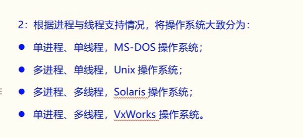
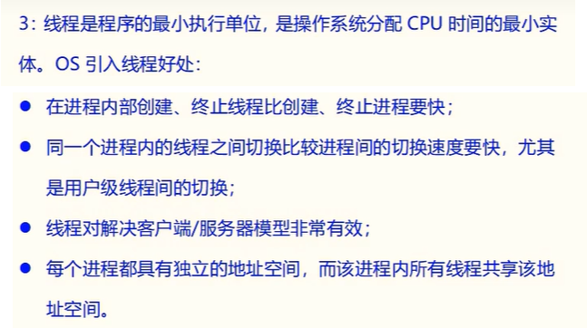
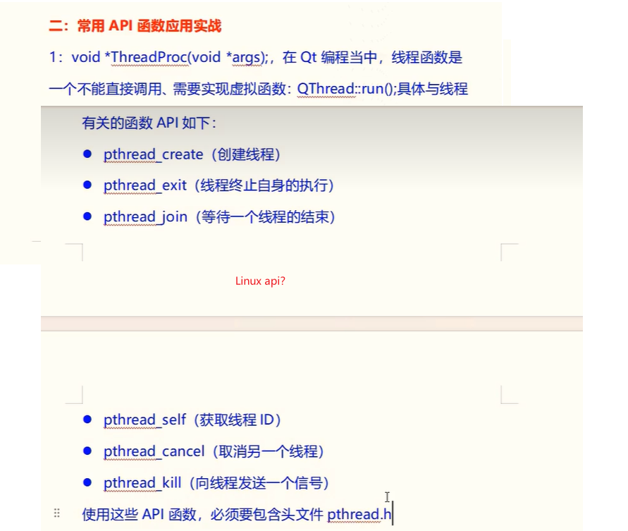

# 1.多线程的基础知识

## 1.1 多线程的重要性

## 1.2 操作系统分类

## 1.3使用线程的好处

## 1.4使用多线程必须考虑如下情况

# 2.常用api函数应用实战

### 参考文档： https://man7.org/linux/man-pages/man3/pthread_create.3.html

# 3.Qt中使用C++11类线程类

## 自己学习

# 4.使用Qt自带的线程类实战(QThread)

## 自己学习
