# 1.应用程序界面

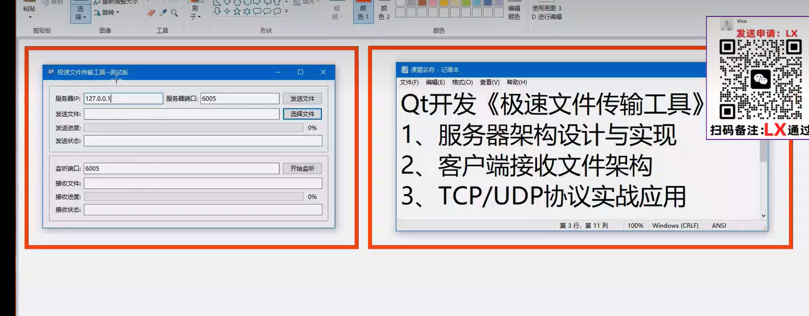

### 参考网址：https://github.com/mengps/FileTransfer

### 参考网址2： https://zhuanlan.zhihu.com/p/32655800303

### 参考网址3：https://zhuanlan.zhihu.com/p/613012877

### 参考网址4：https://dev.to/samsungplay/on-a-quest-for-the-fastest-p2p-file-transfer-cli-thruflux-open-alpha-49oi

### 网址4的源码：https://github.com/samsungplay/Thruflux

### 参考网址5：https://developer.aliyun.com/article/838245

# 课程演练

## 1.新建一个项目， 起名myqtfiletool,继承自QDialog

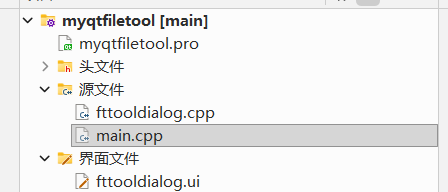

## 2.然后我们在下面源码文件夹里面新建一个images文件夹，里面放置一个图片

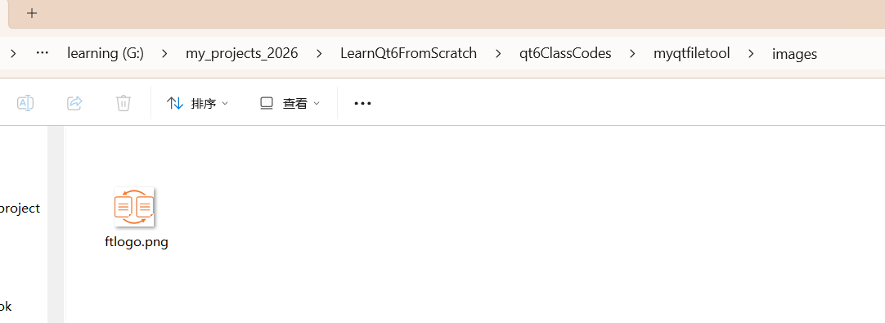

## 3.给项目添加一个res.qrc文件，然后qt会打开这个文件，点击添加前缀按钮，把前缀一栏的所有内容清空

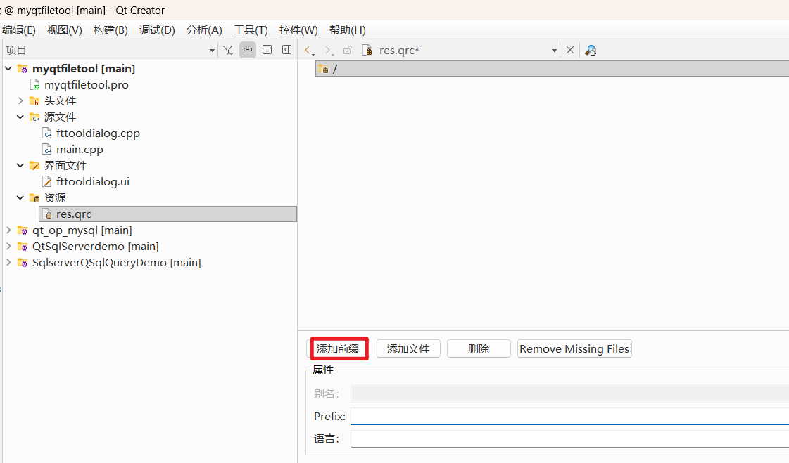

## 4.点击添加文件把我们的图片添加进来

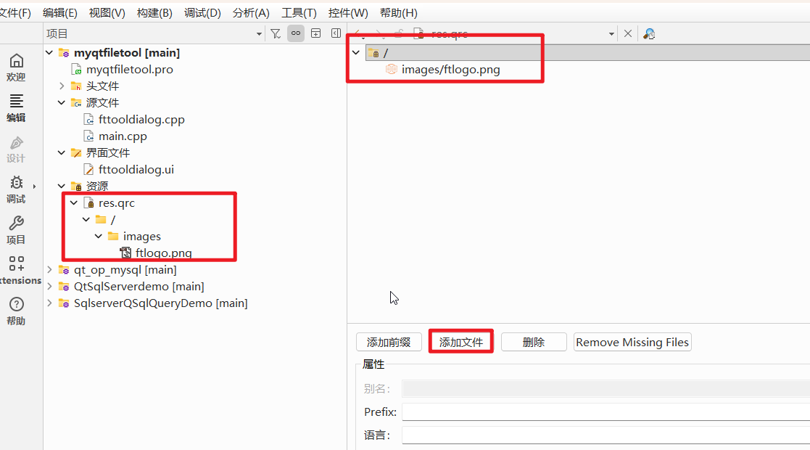

## 5.点击ui界面，在windowicon一栏选择我们的图片

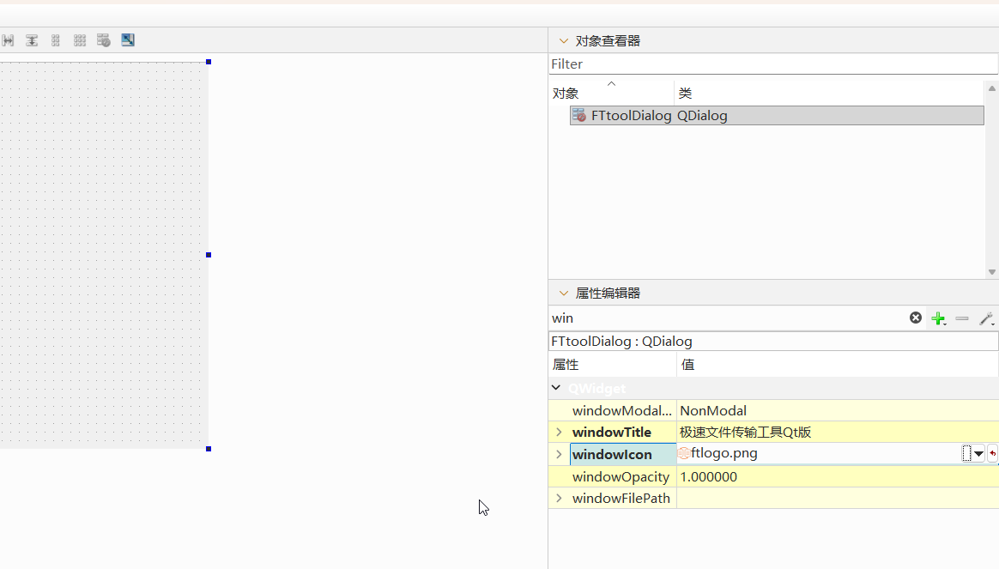

### 运行程序，发现图标成功加载了

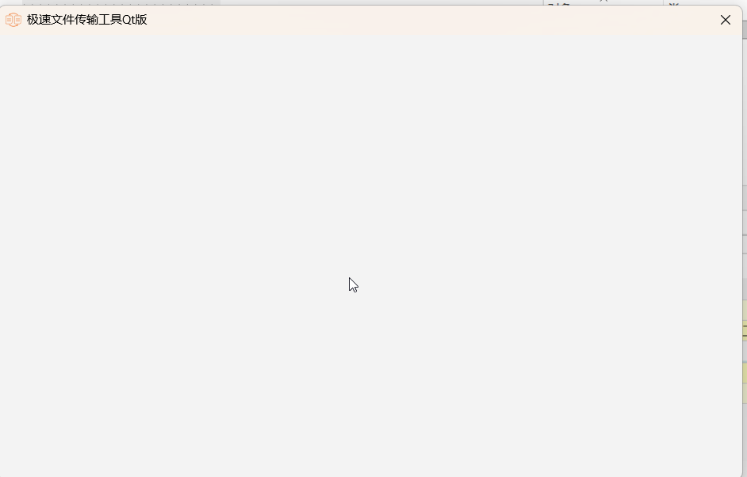

## 6.然后我们把界面设计如下

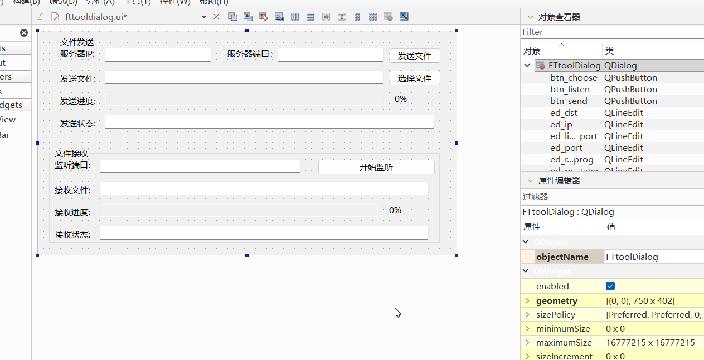

## 7.为所有的按钮添加clicked槽函数

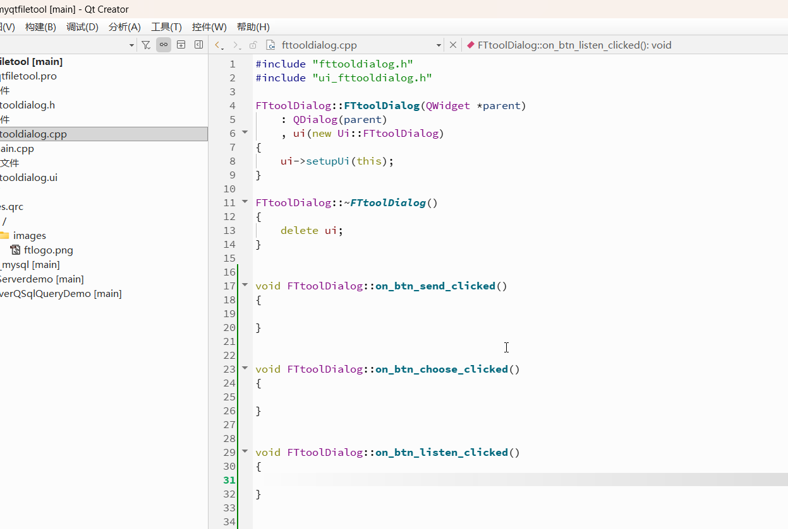

## 8.给服务器ip添加默认值127.0.0.1,发送端口和接受端口都是6005

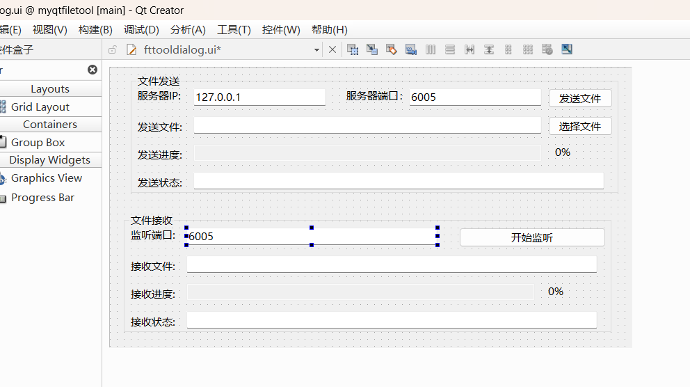

## 9.我们可以在槽函数中添加一条生成语句，看看它是否能够触发（有时候，组合框会挡在前面，我们无法点击按钮，如果这样子，我们需要把组合框放到后面）

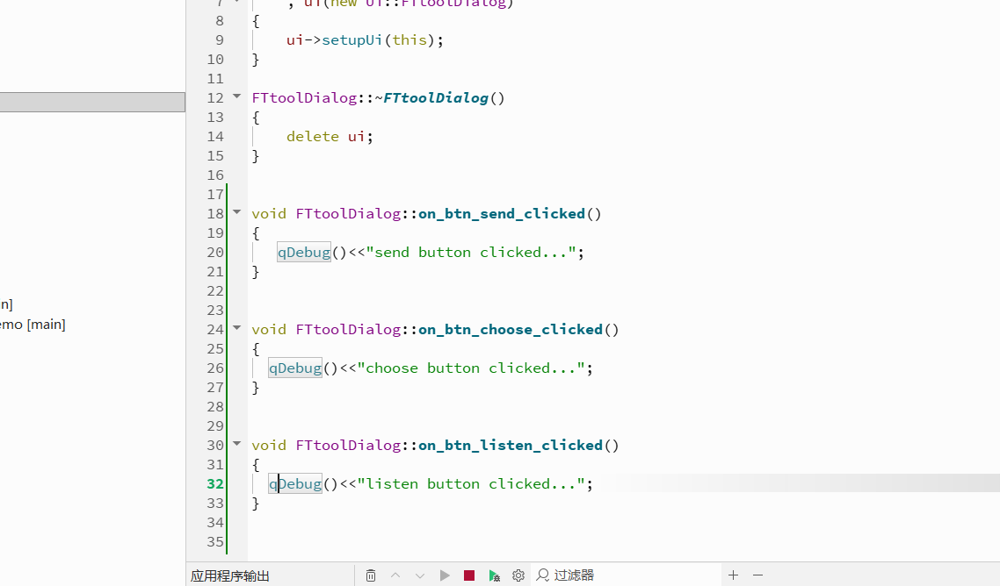

### 运行程序，发现所有按钮都工作正常。。。

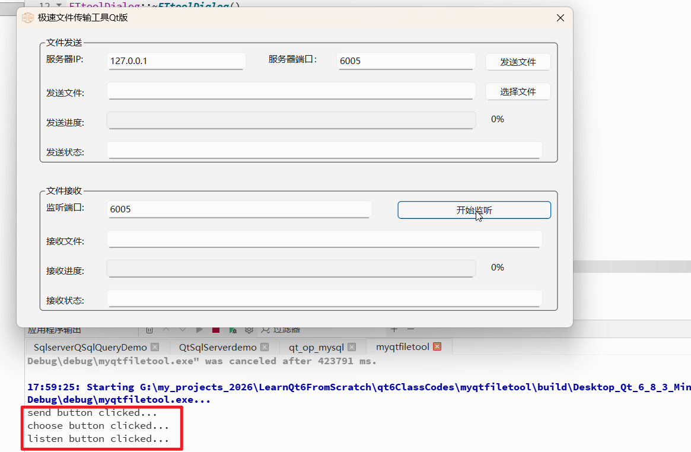

## 10.为了方便编程，我们新建一个类MyHelper，从CObject派生

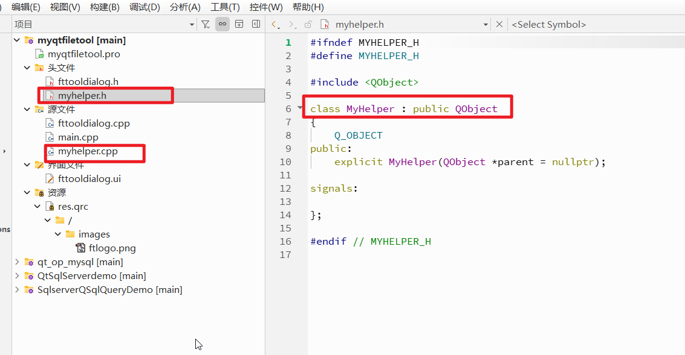

## 11.我们在这个帮助类里面设置一些公共方法，这里我们先添加一个选择文件的方法

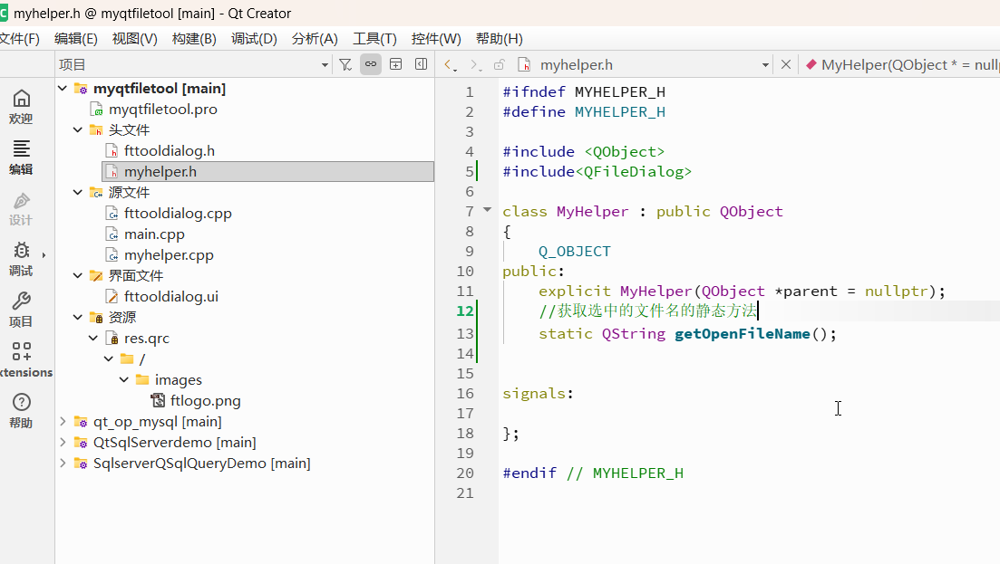

## 12.这个方法的实现其实很简单，就是把文件对话框选择的文件名称返回

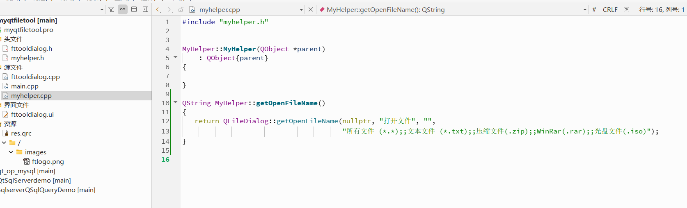

## 13.我们发现界面文件那两个需要进度的地方用错控件了，我们需要把编辑框改为进度条

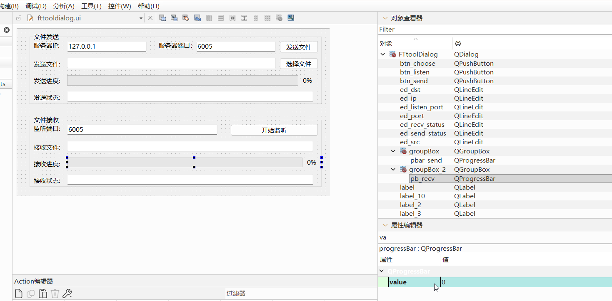

## 14.在给MyHelper类添加一个开机启动的函数

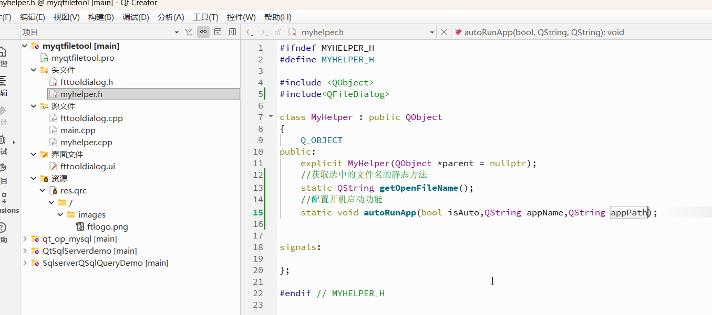

## 15.然后添加函数的实现代码

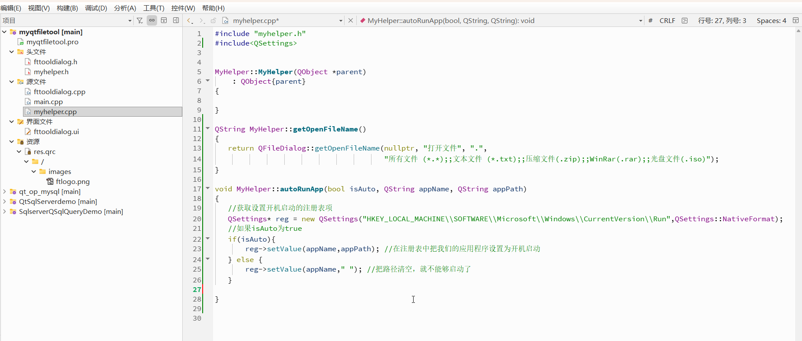

## 16.然后给MyHelper类添加一个验证ip地址的函数，保证用户输入的是正确格式的ip

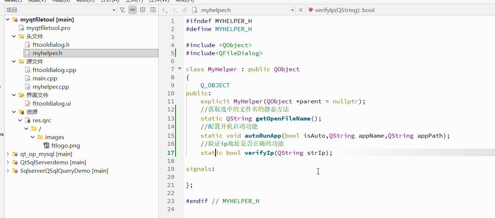

## 17.然后在实现代码里面我们用正则表达式来验证ip地址是否正确，最简单的方法是使用QHostAddress我们需要端口.pro文件添加QT += network,然后包含QHostAddress头文件，然后代码就非常简单

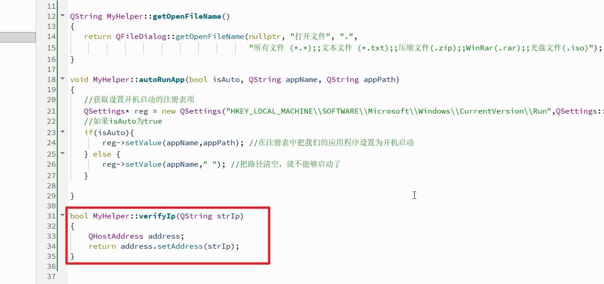

## 老师的视频到此为止，剩下的需要自己慢慢完成

# 避坑指南

## 1.QDirModel已经过时在qt6被移除了，需要使用QFileSystemModel

## 2.出现“'QRegExp' was not declared in this scope”错误，通常是因为你使用的是新版 Qt (Qt 6 及以上)。在新版本中，旧的 `QRegExp` 已经被移除，官方推荐使用性能更好、语法更规范的 `QRegularExpression`

旧代码：

cpp

```
QRegExp rx("\\d+");
if (rx.indexIn(myString) != -1) {
    QString match = rx.cap(0);
} # 在qt6会报错
```

新代码：

cpp

```
QRegularExpression rx("\\d+");
QRegularExpressionMatch match = rx.match(myString);
if (match.hasMatch()) {
    QString matchedString = match.captured(0);
}
```

## 3.出现 `'QDesktopWidget' was not declared in this scope` 错误，是因为你正在使用 **Qt 6**。在 **Qt 6** 中，`QDesktopWidget` 及其配套的 `QApplication::desktop()` 已经被完全移除。 [[1](https://doc.qt.io/qt-6/widgets-changes-qt6.html)]

要解决这个问题，你需要将代码替换为现代的 **`QScreen`** API。 [[1](https://doc.qt.io/qt-6/widgets-changes-qt6.html)]

快速替换指南

请参考以下常用的代码替换方案，将原来的 `QDesktopWidget` 改为 `QScreen`：

1. 获取屏幕分辨率 (Screen Size)

- **旧代码 (Qt 5):**

  cpp

  ```
  QDesktopWidget *desktop = QApplication::desktop();
  QRect rect = desktop->screenGeometry();
  int width = rect.width();
  int height = rect.height();
  ```

  请谨慎使用此类代码。

- **新代码 (Qt 6):**

  cpp

  ```
  QScreen *screen = QGuiApplication::primaryScreen();
  QRect rect = screen->geometry();
  int width = rect.width();
  int height = rect.height();
  ```

  请谨慎使用此类代码。

  

- 获取任务栏可见工作区 (Available Geometry)

- **旧代码 (Qt 5):**

  cpp

  ```
  QDesktopWidget *desktop = QApplication::desktop();
  QRect rect = desktop->availableGeometry();
  ```

  请谨慎使用此类代码。

- **新代码 (Qt 6):**

  cpp

  ```
  QScreen *screen = QGuiApplication::primaryScreen();
  QRect rect = screen->availableGeometry();
  ```

  请谨慎使用此类代码。

  

- 将窗口居中显示 (Center on Screen)

- **旧代码 (Qt 5):**

  cpp

  ```
  QDesktopWidget *desktop = QApplication::desktop();
  move((desktop->width() - width()) / 2, (desktop->height() - height()) / 2);
  ```

  请谨慎使用此类代码。

- **新代码 (Qt 6):**

  cpp

  ```
  QScreen *screen = QGuiApplication::primaryScreen();
  QRect screenGeometry = screen->availableGeometry();
  move((screenGeometry.width() - width()) / 2, (screenGeometry.height() - height()) / 2);
  ```

  请谨慎使用此类代码。

  

💡 核心类对比记忆

可以把 `QScreen` 看作是一个虚拟的显示器接口。

- `QApplication::desktop()` 所有的屏幕信息，现在交给了 `QGuiApplication::screens()`（所有屏幕）和 `QGuiApplication::primaryScreen()`