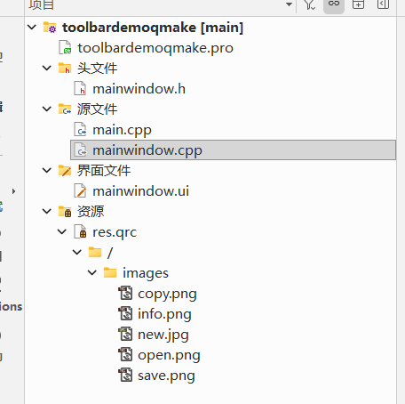
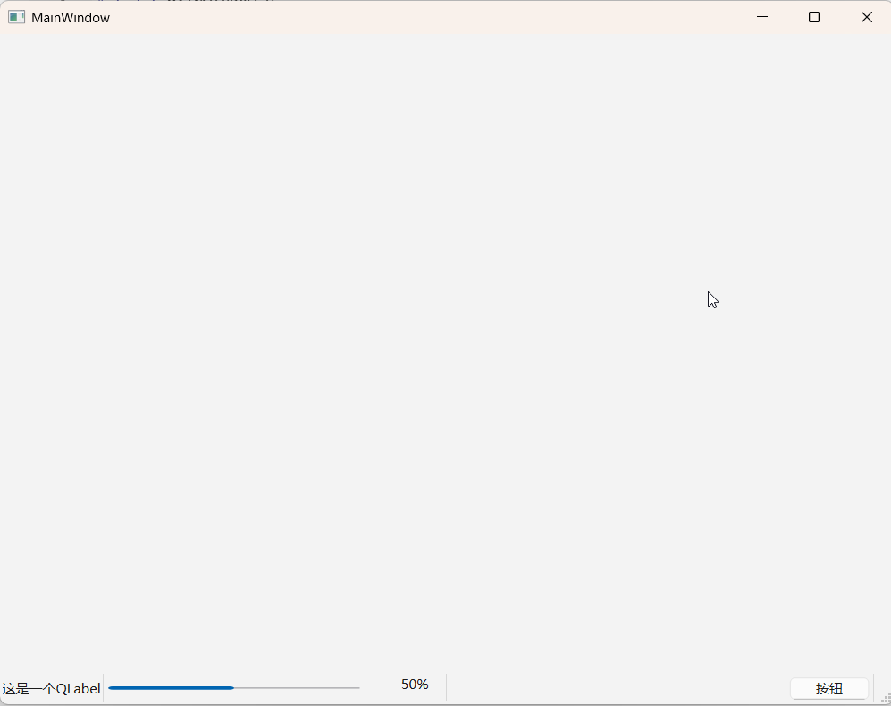
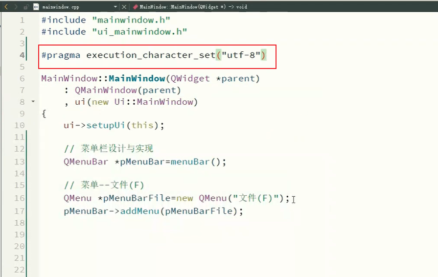
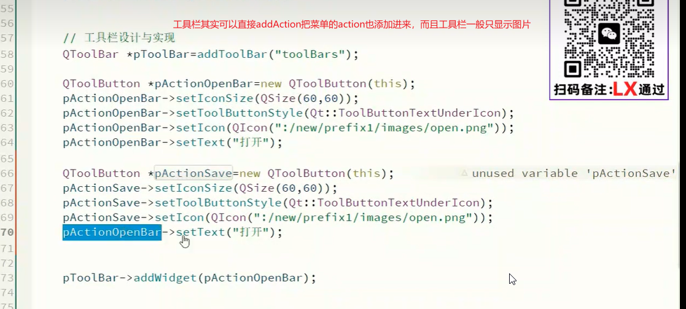
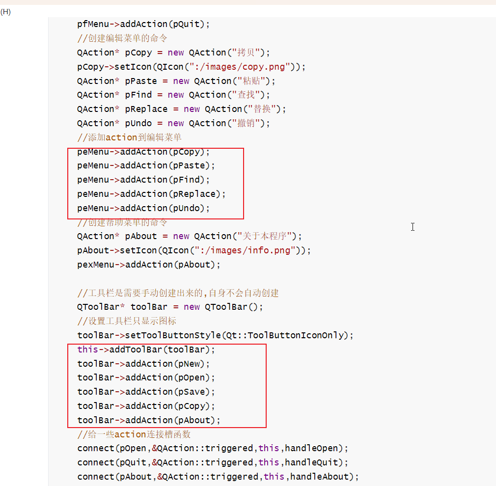

# 1.简单介绍

Qt 的“菜单栏-工具栏-状态栏”是构建桌面应用标准 GUI 的三大核心模块。它们均依赖于 `QMainWindow` 窗口基类，分别负责**顶层操作聚合**、**快捷入口提供**与**底部信息反馈**。 [[1](https://doc.qt.io/qt-6/zh/qtwidgets-mainwindows-menus-example.html), [2](https://cloud.tencent.com/developer/article/2286044), [3](https://blog.csdn.net/CH3CH2CH4/article/details/142068078), [4](https://www.devbean.net/2012/09/qt-study-road-2-menubar-toolbar-statusbar/)]

------

1. 菜单栏 (QMenuBar)

位于主窗口最顶部，提供下拉式的层级命令分类。 [[1](https://juejin.cn/post/7117493144656527368)]

- **核心功能**：容纳 `QMenu`（如“文件”、“编辑”）和 `QAction`（具体功能项，如“打开”、“保存”）。 [[1](https://developer.aliyun.com/article/1376469)]
- **常用 API** :
  - `menuBar()->addMenu("文件")`：添加顶级菜单。
  - `fileMenu->addAction(openAction)`：将具体动作加入菜单。 [[1](https://developer.aliyun.com/article/1376469)]
- **特点**：macOS 系统下会自动全局接管顶部菜单栏。 [[1](https://support.apple.com/zh-cn/guide/mac-help/mchl4af84660/mac), [2](https://jingyan.baidu.com/article/9f63fb914b780189410f0e58.html)]
- 工具栏 (QToolBar)

通常紧贴在菜单栏下方或窗口四周，提供常用功能的快捷图标按钮。 [[1](https://blog.csdn.net/CH3CH2CH4/article/details/142068078)]

- **核心功能**：通过直观的图标和简短文本，允许用户快速点击执行高频操作。
- **常用 API** :
  - `addToolBar("工具栏名称")`：在主窗口创建工具栏。
  - `toolBar->addAction(openAction)`：将动作以按钮形式添加到工具栏。
  - `setAllowedAreas(Qt::ToolBarArea)`：限制拖拽停靠范围（如上下左右）。 [[1](https://juejin.cn/post/7117493144656527368)]
- **特点**：支持用户手动拖拽浮动或吸附在窗口边缘。 [[1](https://cloud.tencent.com/developer/article/2286044)]
- 状态栏 (QStatusBar)

位于主窗口最底部，用于显示应用的状态信息、进度或操作提示。 [[1](https://www.devbean.net/2012/09/qt-study-road-2-menubar-toolbar-statusbar/), [2](https://www.cnblogs.com/wgwyanfs/p/19752428)]

- **核心功能**：分为临时消息（如“文件已保存”，数秒后消失）和永久消息（如版本号、常驻图标）。 [[1](https://www.cnblogs.com/wgwyanfs/p/19752428)]
- **常用 API** :
  - `statusBar()->showMessage("准备就绪", 2000)`：显示持续 2 秒的临时消息。
  - `statusBar()->addPermanentWidget(myLabel)`：添加永久常驻控件。 [[1](https://www.devbean.net/2012/09/qt-study-road-2-menubar-toolbar-statusbar/)]

💡 核心枢纽：QAction (动作)

菜单栏和工具栏通常不直接绑定复杂的逻辑，而是通过 **`QAction`** 连接。您可以创建一个 `QAction`，同时设置其文本、图标和快捷键，然后将其同时添加到菜单栏和工具栏中。 [[1](https://blog.csdn.net/CH3CH2CH4/article/details/142068078), [2](https://juejin.cn/post/7117493144656527368)]

快速实现示例 (C++)

cpp

```
#include <QMainWindow>
#include <QMenuBar>
#include <QToolBar>
#include <QStatusBar>
#include <QAction>

// 示例：在 MainWindow 构造函数中
MainWindow::MainWindow(QWidget *parent) : QMainWindow(parent) {
    // 1. 菜单栏
    QMenu *fileMenu = menuBar()->addMenu("文件");
    QAction *openAction = fileMenu->addAction("打开");
    
    // 2. 工具栏
    QToolBar *toolBar = addToolBar("主工具栏");
    toolBar->addAction(openAction); // 复用 Action
    
    // 3. 状态栏
    statusBar()->showMessage("就绪", 2000);
}
```

# 2.参考文档

# [构建现代Qt GUI：从菜单栏到对话框的完整界面设计指南](https://www.cnblogs.com/wgwyanfs/p/19752428)

在当今以用户体验为核心的软件开发时代，一个直观、高效且美观的图形用户界面（GUI）是应用程序成功的关键。Qt框架，作为跨平台C++开发的行业标准，提供了一套强大而灵活的组件库，帮助开发者构建从简单工具到复杂企业级应用的各种界面。本文将深入探讨Qt中构成主窗口界面的核心组件——菜单栏、工具栏、状态栏、浮动窗口以及对话框，通过详尽的代码示例和最佳实践，为你揭开构建专业级Qt应用程序界面的奥秘。

## 一、菜单栏：应用程序的指挥中心

菜单栏是传统桌面应用程序的导航核心，位于主窗口顶部，为用户提供结构化访问所有功能的途径。在Qt中，**QMenuBar**类负责实现菜单栏功能。一个主窗口通常只包含一个菜单栏，它像应用程序的“总指挥部”，将各种操作分门别类地组织起来。

创建菜单栏的基本流程非常直观：首先通过`menuBar()`函数获取或创建菜单栏对象，然后使用`addMenu()`添加顶级菜单（如“文件”、“编辑”、“视图”等），最后在每个菜单下使用`addAction()`添加具体的菜单项。为了提升菜单的可读性，你还可以使用`addSeparator()`在相关功能组之间添加分割线。

以下是一个创建基本“文件”菜单的代码示例：

### mainwindow.h

```
#ifndef MAINWINDOW_H
#define MAINWINDOW_H

#include <QMainWindow>

QT_BEGIN_NAMESPACE
namespace Ui { class MainWindow; }
QT_END_NAMESPACE

class MainWindow : public QMainWindow
{
    Q_OBJECT

public:
    MainWindow(QWidget *parent = nullptr);
    ~MainWindow();
public slots:
    void handleOpen();
    void handleQuit();
    void handleAbout();

private:
    Ui::MainWindow *ui;
};
#endif // MAINWINDOW_H

```


### mainwindow.cpp

```cpp
#include "mainwindow.h"
#include "ui_mainwindow.h"
#include<QMenuBar>
#include<QMenu>
#include<QAction>
#include<QFileDialog>
#include<QMessageBox>

MainWindow::MainWindow(QWidget *parent)
    : QMainWindow(parent)
    , ui(new Ui::MainWindow)
{
    ui->setupUi(this);
    //手动添加菜单
    //创建菜单条
    QMenuBar* pmBar = new QMenuBar();
    this->setMenuBar(pmBar);
    //创建菜单
    QMenu* pfMenu = new QMenu("文件");
    QMenu* peMenu = new QMenu("编辑");
    QMenu* pexMenu = new QMenu("帮助");
    //把菜单添加到菜单条
    pmBar->addMenu(pfMenu);
    pmBar->addMenu(peMenu);
    pmBar->addMenu(pexMenu);
    //创文件建菜单的命令Action
    QAction* pNew = new QAction("新建");
    QAction* pOpen = new QAction("打开");
    QAction* pSave = new QAction("保存");
    QAction* pSaveAs = new QAction("另存为");
    QAction* pQuit = new QAction("退出");
    //添加action到文件菜单
    pfMenu->addAction(pNew);
    pfMenu->addAction(pOpen);
    pfMenu->addAction(pSave);
    pfMenu->addAction(pSaveAs);
    pfMenu->addAction(pQuit);
    //创建编辑菜单的命令
    QAction* pCopy = new QAction("拷贝");
    QAction* pPaste = new QAction("粘贴");
    QAction* pFind = new QAction("查找");
    QAction* pReplace = new QAction("替换");
    QAction* pUndo = new QAction("撤销");
    //添加action到编辑菜单
    peMenu->addAction(pCopy);
    peMenu->addAction(pPaste);
    peMenu->addAction(pFind);
    peMenu->addAction(pReplace);
    peMenu->addAction(pUndo);
    //创建帮助菜单的命令
    QAction* pAbout = new QAction("关于本程序");
    pexMenu->addAction(pAbout);

    //给一些action连接槽函数
    connect(pOpen,&QAction::triggered,this,handleOpen);
    connect(pQuit,&QAction::triggered,this,handleQuit);
    connect(pAbout,&QAction::triggered,this,handleAbout);
}
MainWindow::~MainWindow()
{
    delete ui;
}
void MainWindow::handleOpen()
{
    QString fileName = QFileDialog::getOpenFileName(
        this,
        tr("Open Document"),
        QDir::homePath(),
        tr("Text Files (*.txt);;All Files (*.*)")
    );
    if(!fileName.isEmpty()){
        this->setWindowTitle(fileName);
    }
}

void MainWindow::handleQuit()
{
    this->close();
}

void MainWindow::handleAbout()
{
    QMessageBox::information(nullptr,"关于本程序","menudemo 版本1.0，版权所有");
}
```

运行效果如下图所示：


关于QMenuBar的创建方式，Qt提供了两种主要方法：一种是使用`QMainWindow::menuBar()`函数，它会返回一个现有的菜单栏或创建一个新的；另一种是直接实例化`QMenuBar`对象并通过`setMenuBar()`设置。第一种方式更为常用和简洁。

```cpp
QMenuBar * menuBar = new QMenuBar();
this->setMenuBar(menuBar);
```

## 二、工具栏：快速访问的利器

如果说菜单栏提供了完整的功能目录，那么工具栏就是最常用功能的“快捷方式面板”。工具栏可以包含按钮、下拉列表、组合框等各种控件，通常以图标形式呈现，支持用户自定义位置和布局。

创建工具栏使用`QMainWindow::addToolBar()`函数：

> 如添加两个⼯具栏.

工具栏的灵活性体现在它的可停靠特性上。你可以通过`setAllowedAreas()`控制工具栏可以停靠的区域：

- `Qt::LeftToolBarArea` - 左侧停靠
- `Qt::RightToolBarArea` - 右侧停靠
- `Qt::TopToolBarArea` - 顶部停靠（默认）
- `Qt::BottomToolBarArea` - 底部停靠
- `Qt::AllToolBarAreas` - 所有区域均可停靠

此外，你还可以控制工具栏是否可浮动（`setFloatable()`）以及是否可移动（`setMovable()`），从而实现完全符合用户偏好的界面布局。

#### 以下是一个创建带有动作的工具栏的完整示例：注意构建工具需要使用qmake，使用cmake无法加载图片，除非你是qml项目



#### mainwindow.h的代码如下

```
#ifndef MAINWINDOW_H
#define MAINWINDOW_H

#include <QMainWindow>

QT_BEGIN_NAMESPACE
namespace Ui { class MainWindow; }
QT_END_NAMESPACE

class MainWindow : public QMainWindow
{
    Q_OBJECT

public:
    MainWindow(QWidget *parent = nullptr);
    ~MainWindow();
public slots:
    void handleOpen();
    void handleQuit();
    void handleAbout();

private:
    Ui::MainWindow *ui;
};
#endif // MAINWINDOW_H


```

#### mainwindow.cpp的代码如下

```cpp
#include "mainwindow.h"
#include "ui_mainwindow.h"
#include<QMenuBar>
#include<QMenu>
#include<QAction>
#include<QFileDialog>
#include<QMessageBox>
#include<QToolBar>
#include<QIcon>
#include<QLabel>
#include<QPixmap>

MainWindow::MainWindow(QWidget *parent)
    : QMainWindow(parent)
    , ui(new Ui::MainWindow)
{
    ui->setupUi(this);
    //手动添加菜单
    //创建菜单条
    QMenuBar* pmBar = new QMenuBar();
    this->setMenuBar(pmBar);
    //创建菜单
    QMenu* pfMenu = new QMenu("文件");
    QMenu* peMenu = new QMenu("编辑");
    QMenu* pexMenu = new QMenu("帮助");
    //把菜单添加到菜单条
    pmBar->addMenu(pfMenu);
    pmBar->addMenu(peMenu);
    pmBar->addMenu(pexMenu);
    //创文件建菜单的命令Action
    QAction* pNew = new QAction("新建");
    pNew->setIcon(QIcon(":/images/new.jpg"));
    QAction* pOpen = new QAction("打开");
    pOpen->setIcon(QIcon(":/images/open.png"));
    QAction* pSave = new QAction("保存");
    pSave->setIcon(QIcon(":/images/save.png"));
    QAction* pSaveAs = new QAction("另存为");
    QAction* pQuit = new QAction("退出");
    //添加action到文件菜单
    pfMenu->addAction(pNew);
    pfMenu->addAction(pOpen);
    pfMenu->addAction(pSave);
    pfMenu->addAction(pSaveAs);
    pfMenu->addAction(pQuit);
    //创建编辑菜单的命令
    QAction* pCopy = new QAction("拷贝");
    pCopy->setIcon(QIcon(":/images/copy.png"));
    QAction* pPaste = new QAction("粘贴");
    QAction* pFind = new QAction("查找");
    QAction* pReplace = new QAction("替换");
    QAction* pUndo = new QAction("撤销");
    //添加action到编辑菜单
    peMenu->addAction(pCopy);
    peMenu->addAction(pPaste);
    peMenu->addAction(pFind);
    peMenu->addAction(pReplace);
    peMenu->addAction(pUndo);
    //创建帮助菜单的命令
    QAction* pAbout = new QAction("关于本程序");
    pAbout->setIcon(QIcon(":/images/info.png"));
    pexMenu->addAction(pAbout);

    //工具栏是需要手动创建出来的,自身不会自动创建
    QToolBar* toolBar = new QToolBar();
    //设置工具栏只显示图标
    toolBar->setToolButtonStyle(Qt::ToolButtonIconOnly);
    this->addToolBar(toolBar);
    toolBar->addAction(pNew);
    toolBar->addAction(pOpen);
    toolBar->addAction(pSave);
    toolBar->addAction(pCopy);
    toolBar->addAction(pAbout);
    //给一些action连接槽函数
    connect(pOpen,&QAction::triggered,this,handleOpen);
    connect(pQuit,&QAction::triggered,this,handleQuit);
    connect(pAbout,&QAction::triggered,this,handleAbout);

}

MainWindow::~MainWindow()
{
    delete ui;
}

void MainWindow::handleOpen()
{
    QString fileName = QFileDialog::getOpenFileName(
        this,
        tr("Open Document"),
        QDir::homePath(),
        tr("Text Files (*.txt);;All Files (*.*)")
    );
    if(!fileName.isEmpty()){
        this->setWindowTitle(fileName);
    }
}

void MainWindow::handleQuit()
{
    this->close();
}

void MainWindow::handleAbout()
{
    QMessageBox::information(nullptr,"关于本程序","menudemo 版本1.0，版权所有");
}

```

## 三、状态栏：实时信息的窗口

状态栏位于主窗口底部，用于显示应用程序的实时状态信息、进度提示或简短帮助文本。一个主窗口通常只有一个状态栏，通过**QStatusBar**类实现。

创建状态栏同样简单：

> 状态栏的创建是通过 **QMainWindow 类** 提供的 **statusBar()** 函数来创建；示例如下：

状态栏消息分为两种类型：**实时消息**和**永久消息**。实时消息会在一段时间后自动清除，适合显示临时状态；而永久消息则会一直显示，直到被明确移除，适合显示如版本号、登录用户等信息。

显示实时消息：

> 在状态栏中显示实时消息是通过 **showMessage() 函数**来实现，示例如下：

显示永久消息：

> 在状态栏中可以显示永久消息，此处的永久消息是通过 **标签** 来显示的；示例如下：

一个综合的状态栏使用示例如下：

#### mainwindow.h

```
#ifndef MAINWINDOW_H
#define MAINWINDOW_H

#include <QMainWindow>

QT_BEGIN_NAMESPACE
namespace Ui { class MainWindow; }
QT_END_NAMESPACE

class MainWindow : public QMainWindow
{
    Q_OBJECT

public:
    MainWindow(QWidget *parent = nullptr);
    ~MainWindow();

private:
    Ui::MainWindow *ui;
};
#endif // MAINWINDOW_H

```


#### mainwindow.cpp

```cpp
#include "mainwindow.h"
#include "ui_mainwindow.h"
#include<QProgressBar>
#include<QPushButton>
#include<QLabel>
MainWindow::MainWindow(QWidget *parent)
    : QMainWindow(parent)
    , ui(new Ui::MainWindow)
{
    ui->setupUi(this);
    //存在就获取,不存在就创建
    QStatusBar * statusBar = this->statusBar();
    // 如果状态栏没有被创建, 这样的设置是必要的.
    // 如果状态栏已经在窗口中存在,这样的设置其实意义不大,但是也没副作用,仍然保留.
    this->setStatusBar(statusBar);
    // //显示一个临时的信息.
    // statusBar->showMessage("这是一个状态消息");
    //给状态栏中添加子控件
    QLabel * label = new QLabel("这是一个QLabel");
    statusBar->addWidget(label);
    QProgressBar * progressBar = new QProgressBar();
    progressBar->setRange(0,100);
    progressBar->setValue(50);
    statusBar->addWidget(progressBar);
    QPushButton * button = new QPushButton("按钮");
    //使用 addPermanentWidget 将这个按钮添加到状态栏的右端.与常规的addWidget不同,addPermanentWidget会将控件固定在状态栏的最右侧,且不随状态栏中的其他控件变化而移动.
    statusBar->addPermanentWidget(button);
}
MainWindow::~MainWindow()
{
    delete ui;
}
```

## 效果：



## 四、浮动窗口：灵活的工作空间

浮动窗口（也称为停靠窗口或铆接部件）是现代IDE和复杂应用程序的标志性特性。在Qt中，**QDockWidget**类让创建可停靠、可浮动的子窗口变得轻而易举。这些窗口可以包含工具面板、属性编辑器、日志查看器等辅助功能模块。

创建浮动窗口的基本模式：

> 浮动窗口的创建是通过 QDockWidget类 提供的构造方法 QDockWidget()函数 动态创建的；示例如下：

你可以精确控制浮动窗口的停靠位置：

> **浮动窗口是位于中心部件的周围**。可以通过 **QDockWidget类** 中提供 **setAllowedAreas()** 函数设置其允许停靠的位置。其中可以设置允许停靠的位置有:

通过`setAllowedAreas()`，你可以限制浮动窗口只能停靠在特定区域，从而创建更加结构化的界面布局。

以下代码创建了一个简单的浮动窗口：

```cpp
#include "mainwindow.h"
#include "ui_mainwindow.h"
#include<QDockWidget> 
#include<QWidget> 
#include<QVBoxLayout>
#include<QLabel> 
#include<QPushButton> 

MainWindow::MainWindow(QWidget *parent)
    : QMainWindow(parent)
    , ui(new Ui::MainWindow)
{
    ui->setupUi(this);
    //给主窗口添加一个子窗口
    QDockWidget * dockWidget = new QDockWidget();
    //使用addDockWidget方法,把浮动窗口加入到子窗口中.
    this->addDockWidget(Qt::LeftDockWidgetArea,dockWidget);
    //浮动窗口也是可以设置标题的
    dockWidget->setWindowTitle("这是浮动窗口");
    // 给浮动窗口内部, 添加一些其他的控件.
    // 不能直接给这个浮动窗口添加子控件, 而是需要创建出一个单独的 QWidget, 把要添加的控件加入到 QWidget 中.
    // 然后再把这个 QWidget 设置到 dockWidget 中.
    QWidget * container = new QWidget();
    dockWidget->setWidget(container);
    //创建布局管理器,把布局管理器设置到QWidget中
    QVBoxLayout * layout = new QVBoxLayout;
    container->setLayout(layout);
    // 创建其他控件添加到 layout 中.
    QLabel * label = new QLabel("这是一个QLabel");
    QPushButton* button = new QPushButton("这是按钮");
    layout->addWidget(label);
    layout->addWidget(button);
    //设置浮动窗口允许停靠的位置
    dockWidget->setAllowedAreas(Qt::LeftDockWidgetArea | Qt::TopDockWidgetArea);
}
MainWindow::~MainWindow()
{
    delete ui;
}
```

[AFFILIATE_SLOT_1]

## 五、对话框：用户交互的桥梁

对话框是应用程序与用户进行重要交互的主要方式，用于收集输入、显示信息或进行确认操作。Qt提供了强大的对话框支持，包括自定义对话框和一系列内置标准对话框。

### 5.1 对话框基础与分类

对话框主要分为两种类型：**模态对话框**和**非模态对话框**。

**模态对话框**会阻塞父窗口，用户必须完成对话框操作后才能继续使用应用程序。这种对话框适用于必须立即处理的场景，如文件保存确认、关键设置等。使用`exec()`方法显示：

```cpp
#include "mainwindow.h"
#include "ui_mainwindow.h"
#include 
MainWindow::MainWindow(QWidget *parent)
    : QMainWindow(parent)
    , ui(new Ui::MainWindow)
{
    ui->setupUi(this);
    connect(ui->actionxinjian,&QAction::triggered,[=]()
    {
        QDialog dlg(this);
        dlg.resize(200,100);
        dlg.exec();
    });
}
MainWindow::~MainWindow()
{
    delete ui;
}
```

**非模态对话框**则允许用户同时与对话框和父窗口交互，适用于查找替换、工具面板等场景。使用`show()`方法显示：

```cpp
#include "mainwindow.h"
#include "ui_mainwindow.h"
#include 
MainWindow::MainWindow(QWidget *parent)
    : QMainWindow(parent)
    , ui(new Ui::MainWindow)
{
    ui->setupUi(this);
    connect(ui->actionxinjian,&QAction::triggered,[=]()
    {
        //非模态对话框,为了防止一闪而过,创建在堆区
        QDialog * dlg = new QDialog(this);
        //调整非模态对话框尺寸
        dlg->resize(200,100);
        /*当dlg2无线创建时(即一直不断地打开关闭窗口),设置下面这个属性就可以在关闭
         非模态对话框时释放这个对象*/
        dlg->setAttribute(Qt::WA_DeleteOnClose);
        dlg->show();
    });
}
MainWindow::~MainWindow()
{
    delete ui;
}
```

### 5.2 Qt内置标准对话框

Qt预置了一系列经过精心设计的标准对话框，覆盖了大多数常见需求：

- **QMessageBox** - 消息对话框，用于提示、警告、错误和询问
- **QFileDialog** - 文件对话框，用于打开和保存文件
- **QColorDialog** - 颜色选择对话框
- **QFontDialog** - 字体选择对话框
- **QInputDialog** - 输入对话框，用于获取各种类型的用户输入

以最常用的**QMessageBox**为例，它提供了多种静态方法快速创建标准消息框：

**问题提示对话框**：

```cpp
#include "mainwindow.h"
#include "ui_mainwindow.h"
#include<QPushButton>
#include<QMessageBox> 
MainWindow::MainWindow(QWidget *parent)
    : QMainWindow(parent)
    , ui(new Ui::MainWindow)
{
    ui->setupUi(this);
    resize(800,600);
    QPushButton * Button1 = new QPushButton("消息对话框",this);
    QMessageBox * Message = new QMessageBox(this);
    //设置消息对话框的标题
    Message->setWindowTitle("Warning Message");
    //设置消息对话的内容
    Message->setText("Error Message!");
    //设置消息对话类型
    Message->setIcon(QMessageBox::Question);
    //在消息对话框上设置按钮
    Message->setStandardButtons(QMessageBox::Ok | QMessageBox::Cancel);
    connect(Button1,&QPushButton::clicked,[=]()
            {
                Message->show();
    });
}
MainWindow::~MainWindow()
{
    delete ui;
}
```

**文件对话框**的使用同样简洁：

```cpp
#include "mainwindow.h"
#include "ui_mainwindow.h"
#include<QPushButton>
#include<QFileDialog> 

MainWindow::MainWindow(QWidget *parent)
    : QMainWindow(parent)
    , ui(new Ui::MainWindow)
{
    ui->setupUi(this);
    resize(800,600);
    QPushButton * Button = new QPushButton("文件",this);
    QFileDialog * FileDialog = new QFileDialog(this);
    connect(Button,&QPushButton::clicked,[=](){
        QString str = FileDialog->getOpenFileName(
            this,//父亲
            "文件",
            "D:\\桌面\\image",//打开的路径
            "*.png"//只保留.png格式文件
            );
    });
}
MainWindow::~MainWindow()
{
    delete ui;
}
```

这些内置对话框不仅外观与操作系统原生风格一致，而且大大减少了开发工作量。

### 5.3 创建自定义对话框

当内置对话框无法满足特定需求时，你可以创建完全自定义的对话框。Qt支持两种主要方式：**纯代码方式**和**Qt Designer图形化方式**。

纯代码方式提供了最大的灵活性：

```cpp
#include "dialog.h"
#include<QVBoxLayout> 
#include<QLabel> 
#include<QPushButton> 
#include<QWidget> 

Dialog::Dialog(QWidget * parent) : QDialog(parent)
{
    //创建出一些控件,加入到Dialog中.(以Dialog作为父窗口)
    QVBoxLayout * Layout = new QVBoxLayout();
    this->setLayout(Layout);
    QLabel * label = new QLabel("这是一个对话框",this);
    QPushButton * button = new QPushButton("关闭",this);
    Layout->addWidget(label);
    Layout->addWidget(button);
    connect(button,&QPushButton::clicked,this,&Dialog::handle);
}
void Dialog::handle()
{
    this->close();
}
```

而使用Qt Designer则可以通过拖放控件快速设计对话框界面，然后使用`uic`工具将.ui文件转换为C++代码。这种方式特别适合复杂布局的对话框。

[AFFILIATE_SLOT_2]

## 六、界面组件的最佳实践与整合

掌握了各个界面组件的使用方法后，如何将它们有机整合成一个协调、高效的应用程序界面，就需要遵循一些最佳实践：

1. **保持一致性**：在整个应用程序中使用统一的图标风格、颜色方案和交互模式。
2. **遵循平台惯例**：不同操作系统有不同的界面规范，Qt能自动适配，但你也应注意平台特定的交互习惯。
3. **提供足够的反馈**：通过状态栏消息、工具提示（tooltip）和适当的启用/禁用状态，让用户清楚了解当前状态和可用操作。
4. **支持可访问性**：为控件添加适当的文本描述，支持键盘导航，确保应用程序对所有用户都友好。
5. **实现可定制性**：允许用户调整工具栏位置、浮动窗口布局等，满足不同工作习惯的需求。

一个设计良好的Qt界面应该像精心组织的办公桌：菜单栏是文件柜，工具栏是手边最常用的工具，状态栏是随时可见的提醒便签，浮动窗口是可以随意摆放的参考书，而对话框则是需要专注处理时的临时工作区。

随着Qt版本的不断演进，这些界面组件也在持续增强。Qt 6引入了更现代化的样式引擎、改进的高DPI支持以及更好的性能优化。无论你是开发传统的桌面应用，还是瞄准新兴的平台，Qt强大的GUI组件库都能为你提供坚实的基础。

通过本文的介绍，你应该已经对Qt主窗口的核心组件有了全面的了解。真正的掌握来自于实践——尝试创建自己的应用程序，从简单的文本编辑器开始，逐步增加复杂度，探索各个组件的所有可能性。记住，优秀的界面设计不仅仅是技术的实现，更是对用户体验的深刻理解。


# 课堂截图

## 1.解决qt显示中文乱码



## 2.这个老师的工具栏编程不够好，它和菜单栏没有上面联系，这个比较麻烦



## 还没有我们自己的代码好

