# 1.内容提要

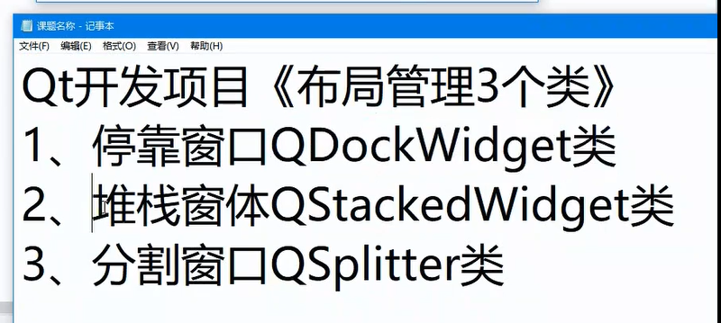

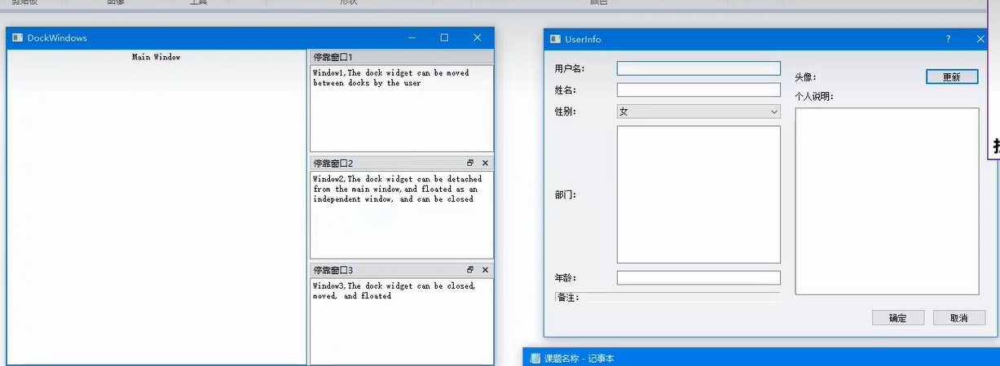

## QDockWidget案例，纯手写，没有使用ui文件

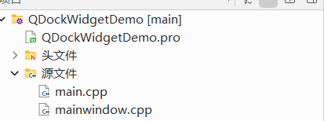


### mainwindow.h的代码如下

```
#ifndef MAINWINDOW_H
#define MAINWINDOW_H

#include <QMainWindow>

class MainWindow : public QMainWindow
{
    Q_OBJECT

public:
    MainWindow(QWidget *parent = nullptr);
    ~MainWindow();
};
#endif // MAINWINDOW_H

```


### mainwindow.cpp的代码如下

```
#include "mainwindow.h"
#include <QTextEdit>
#include <QDockWidget>

MainWindow::MainWindow(QWidget *parent)
    : QMainWindow(parent)
{
    //创建第一个edit
    QTextEdit *edit = new QTextEdit(this);
    edit->setText(tr("Main Window"));
    edit->setAlignment(Qt::AlignCenter);
    setCentralWidget(edit);

    //停靠窗口1
    QDockWidget *dock1 = new QDockWidget(tr("DockWindow1"),this);
    //设置可移动
    dock1->setFeatures(QDockWidget::DockWidgetMovable);
    //设置可以移动的区域
    dock1->setAllowedAreas(Qt::LeftDockWidgetArea | Qt::RightDockWidgetArea);
    //创建第2个编辑框
    QTextEdit *edit1 = new QTextEdit();
    edit1->setText(tr("window1,the dock widget can be moved between docks by the user " ""));
    //把编辑框添加到停靠窗口
    dock1->setWidget(edit1);
    //把停靠窗口添加到主窗口
    addDockWidget(Qt::RightDockWidgetArea,dock1);
    //停靠窗口2，可以关闭和浮动的
    QDockWidget *dock2 = new QDockWidget(tr("DockWindow2"),this);
    //设置可以可以关闭和可以浮动
    dock2->setFeatures(QDockWidget::DockWidgetClosable |QDockWidget::DockWidgetFloatable);
    //创建第3个编辑框
    QTextEdit *edit2 = new QTextEdit();
    edit2->setText(tr("window2,the dock widget can be closed and floatting" ""));
    //把编辑框添加到停靠窗口
    dock2->setWidget(edit2);
    //把停靠窗口添加到主窗口
    addDockWidget(Qt::RightDockWidgetArea,dock2);
     //停靠窗口3，有所有特性
    QDockWidget *dock3 = new QDockWidget(tr("DockWindow3"),this);
    //注意QDockWidget::AllDockWidgetFeatures在qt5.15以后已经不存在了，别移除
    dock3->setFeatures(QDockWidget::DockWidgetClosable |
                       QDockWidget::DockWidgetMovable |
                       QDockWidget::DockWidgetFloatable);
    //创建第4个编辑框
    QTextEdit *edit3 = new QTextEdit();
    edit3->setText(tr("Window3,the dock widget can be closed,moved,and floated"));
    dock3->setWidget(edit3);
    addDockWidget(Qt::RightDockWidgetArea,dock3);

}

MainWindow::~MainWindow()
{
}


```

### main.cpp的内容如下

```
#include "mainwindow.h"
#include <QApplication>

int main(int argc, char *argv[])
{
    QApplication a(argc, argv);
    MainWindow w;
    w.show();
    return a.exec();
}

```

## 效果

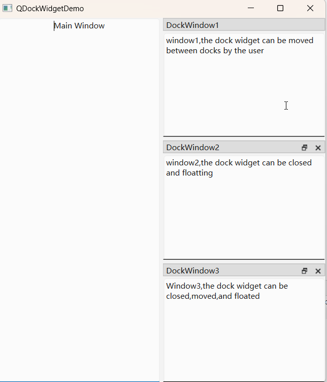

## QSpliter案例，虽然创建了ui文件，但是我们没有使用

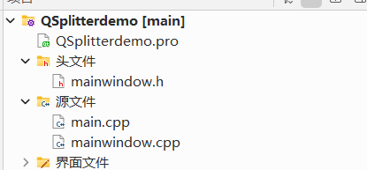


### mainwindow.h的代码如下

```
#ifndef MAINWINDOW_H
#define MAINWINDOW_H

#include <QMainWindow>

QT_BEGIN_NAMESPACE
namespace Ui { class MainWindow; }
QT_END_NAMESPACE

class MainWindow : public QMainWindow
{
    Q_OBJECT

public:
    MainWindow(QWidget *parent = nullptr);
    ~MainWindow();

private:
    Ui::MainWindow *ui;
};
#endif // MAINWINDOW_H

```


### mainwindow.cpp的代码如下

```
#include "mainwindow.h"
#include "ui_mainwindow.h"

MainWindow::MainWindow(QWidget *parent)
    : QMainWindow(parent)
    , ui(new Ui::MainWindow)
{
    ui->setupUi(this);
}

MainWindow::~MainWindow()
{
    delete ui;
}


```

### main.cpp的代码如下

```
#include "mainwindow.h"
#include <QApplication>
#include <QFont>
#include <QSplitter>
#include <QTextEdit>
#include <QApplication>

int main(int argc, char *argv[])
{
    QApplication a(argc, argv);

    QFont font("华文行楷",14);
    a.setFont(font);
    //主分割窗口
    QSplitter *splMain = new QSplitter(Qt::Horizontal,0);
    QTextEdit *leftEdit = new QTextEdit(QObject::tr("Left Widget"),splMain);
    leftEdit->setAlignment(Qt::AlignCenter);
    //右分割窗口
    QSplitter *splRight = new QSplitter(Qt::Vertical,splMain);
    splRight->setOpaqueResize(false);
    QTextEdit *upEdit = new QTextEdit(QObject::tr("Top Widget"),splRight);
    upEdit->setAlignment(Qt::AlignCenter);
    QTextEdit *bottomEdit = new QTextEdit(QObject::tr("Bottom Widget"),splRight);
    bottomEdit->setAlignment(Qt::AlignCenter);
    //开始分割
    splMain->setStretchFactor(1,1);
    splMain->setWindowTitle(QObject::tr("Splitter"));
    splMain->show();

    // MainWindow w;
    // w.show();
    return a.exec();
}

```

## 效果

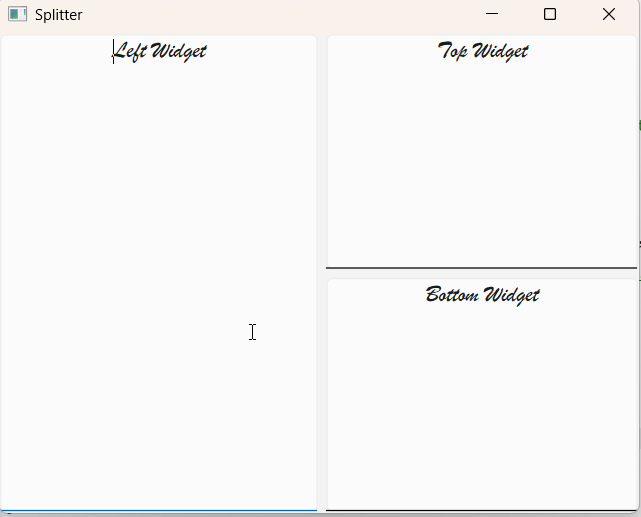


## QStackedWidget案例，也是没有使用ui文件，继承QDialog

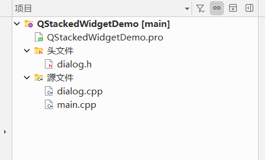


### dialog.h的代码如下

```
#ifndef DIALOG_H
#define DIALOG_H

#include <QDialog>
#include <QListWidget>
#include <QStackedWidget>
#include <QLabel>

class Dialog : public QDialog
{
    Q_OBJECT

public:
    Dialog(QWidget *parent = nullptr);
    ~Dialog();
private:
    QListWidget *list;
    QStackedWidget *stackW;
    QLabel *label1;
    QLabel *label2;
    QLabel *label3;
};
#endif // DIALOG_H

```


### dialog.cpp的代码如下

```
#include "dialog.h"
#include <QHBoxLayout>

Dialog::Dialog(QWidget *parent)
    : QDialog(parent)
{
    setWindowTitle("StackedWidget Demo");

    //创建list指向的对象
    list = new QListWidget(this);
    //在新建的QListWidget控件中插入三个条目，作为选择项
    list->insertItem(0,tr("Window1"));
    list->insertItem(1,tr("Window2"));
    list->insertItem(2,tr("Window3"));
    //创建3给并且
    label1 = new QLabel(tr("Widget1 of StackedWidget"));
    label2 = new QLabel(tr("Widget2 of StackedWidget"));
    label3 = new QLabel(tr("Widget3 of StackedWidget"));
    //创建StackedWidget对象并且返回指针
    stackW = new QStackedWidget(this);
    //把标签添加到StackedWidget对象
    stackW->addWidget(label1);
    stackW->addWidget(label2);
    stackW->addWidget(label3);
    //创建一个水平布局对象标签返回指针
    QHBoxLayout *hlayout = new QHBoxLayout(this);
    hlayout->setSpacing(5);
    hlayout->addWidget(list);
    hlayout->addWidget(stackW,0,Qt::AlignHCenter);
    hlayout->setStretchFactor(list,1);
    hlayout->setStretchFactor(stackW,3);
    //连接 QListWidget的currentRowChanged信号到QStackedWidget的setCurrentIndex槽函数实现点击切换控件
    connect(list,SIGNAL(currentRowChanged(int)),stackW,SLOT(setCurrentIndex(int)));
}

Dialog::~Dialog()
{
}


```

### 效果

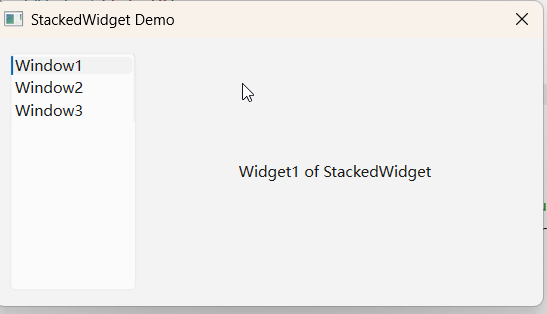


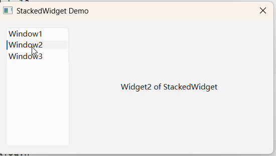

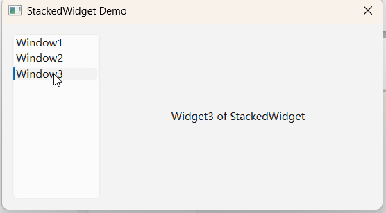

# 2，老师案例

### 2.1 第一个停靠窗口案例

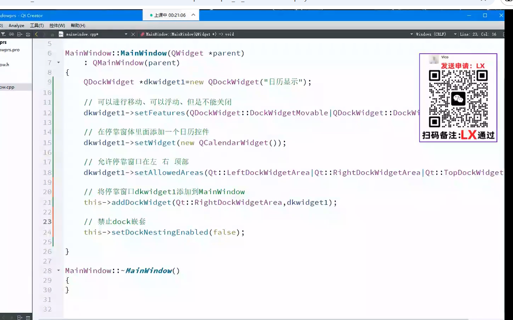

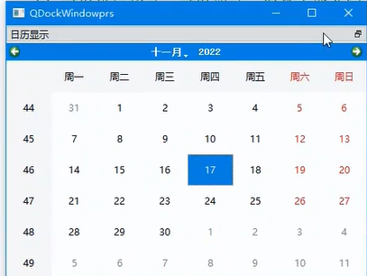

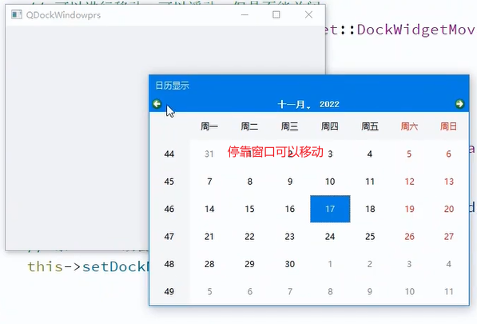

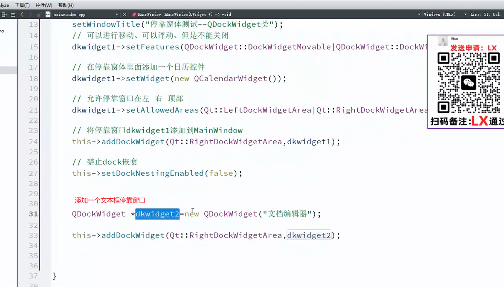

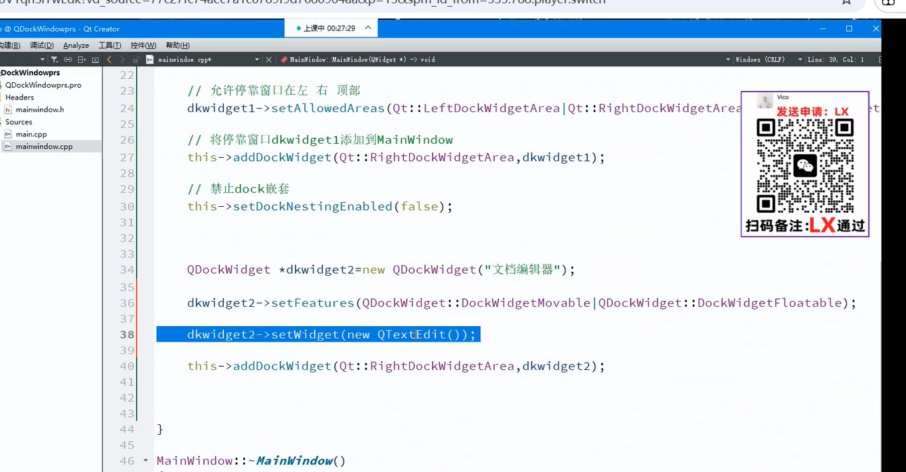

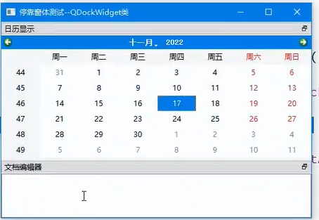

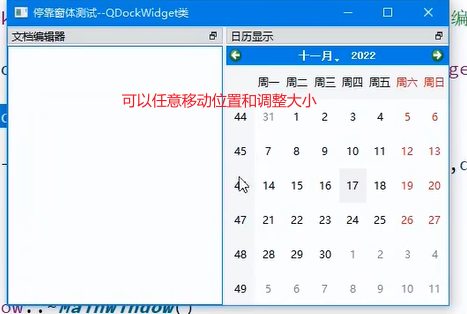

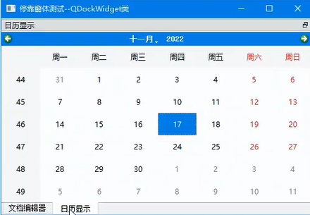

### 2.2 第二个停靠窗口案例

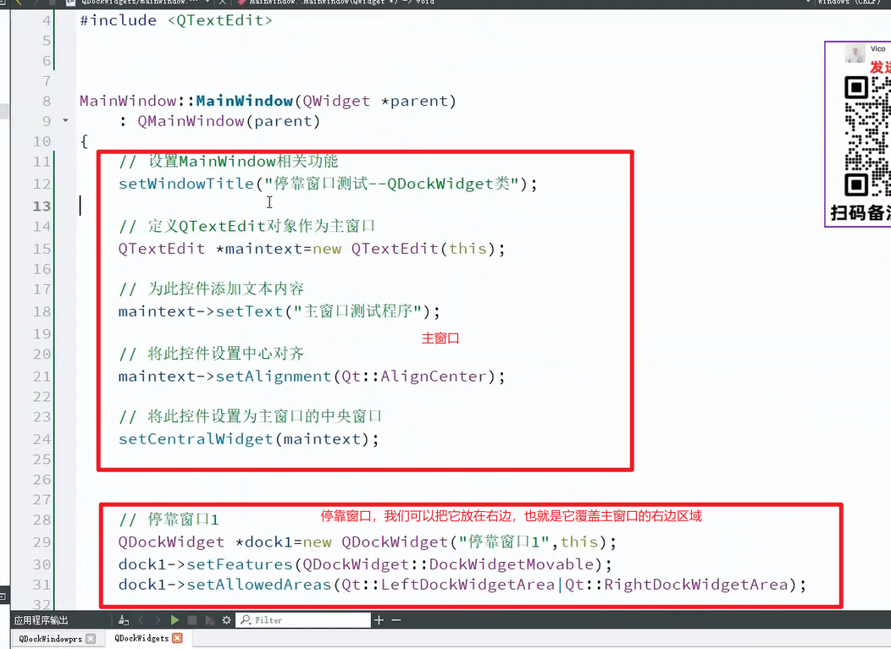

#### 当然也可以放在左边

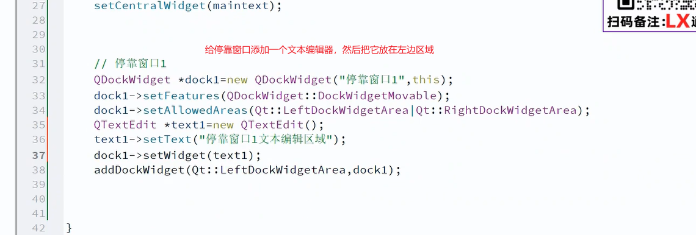

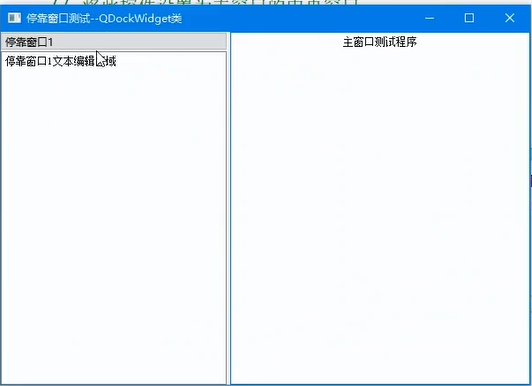

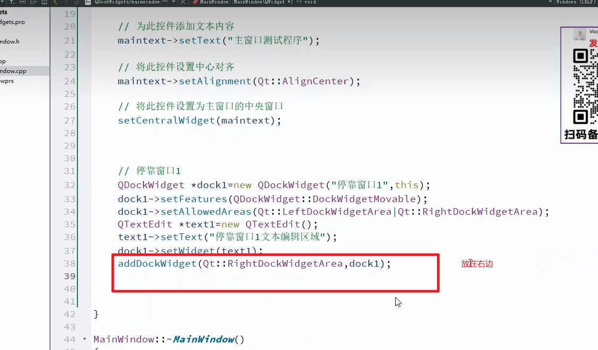

### 再添加2个停靠窗口

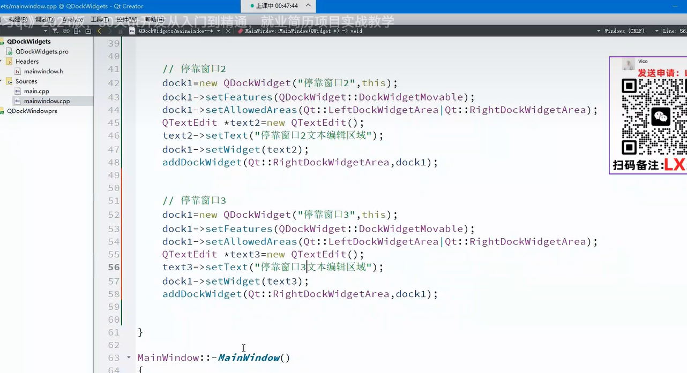


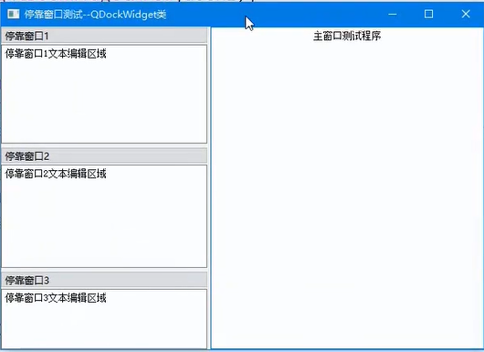
