# 1.Qt非常常用的15种控件

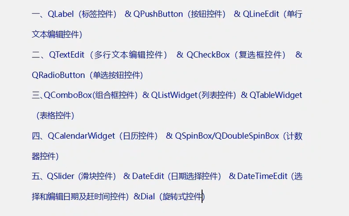

## 以前我还真不知道有这两个控件

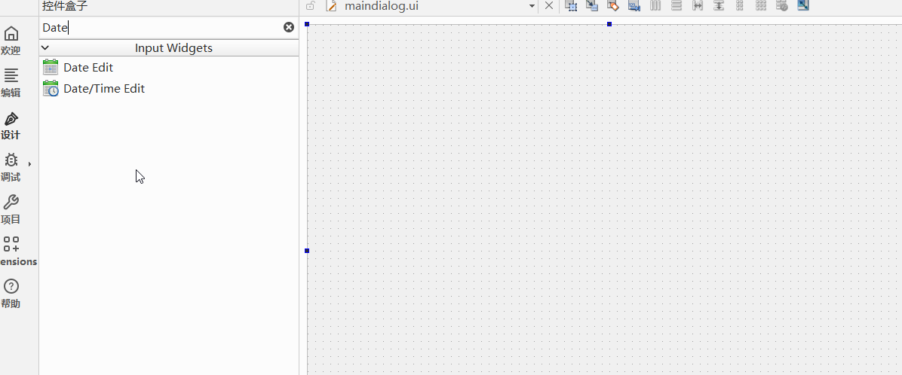

### 小技巧，如何把一个文本框设置为密码框？

#### 1.Qt默认没有密码框，密码框是用LineEdit控件改造而来的，选择一个文本框，然后在设计器的属性面板里面找echoMode，把它改为password

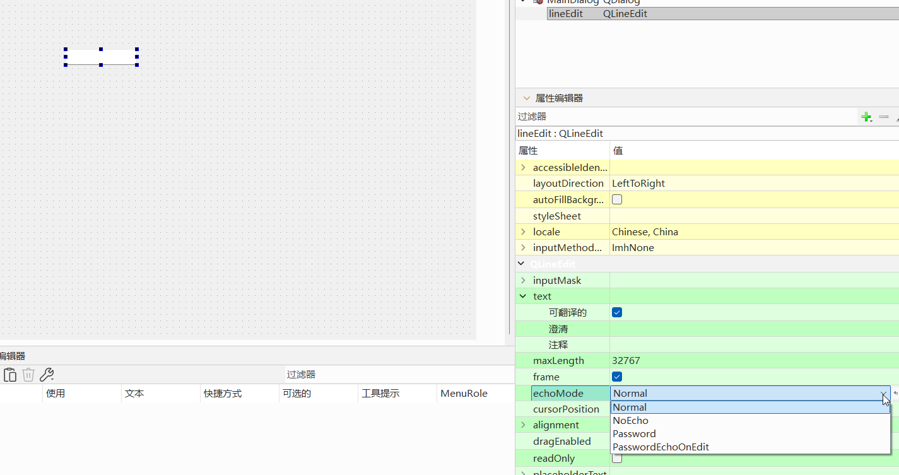

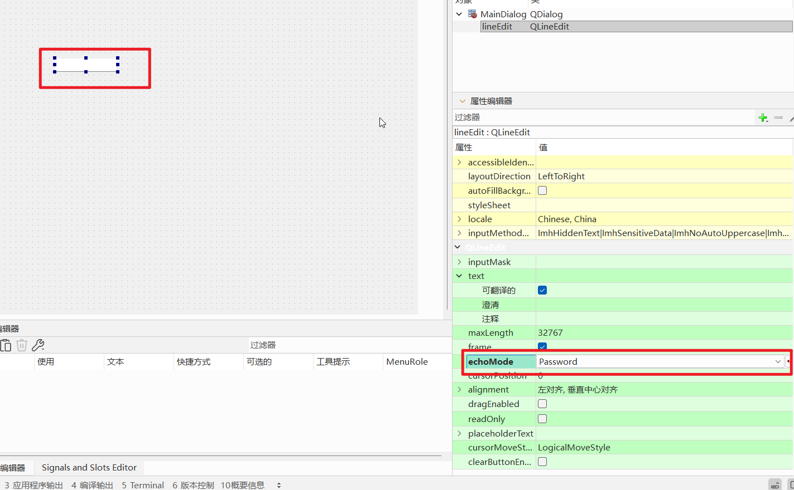

#### 2.当然也可以用代码来动态修改，注意他的参数是一个枚举值

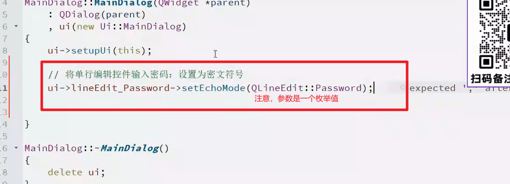

### 小技巧，qt解决中文乱码。在头文件添加： \#pragma execution_character_set("utf-8")宏

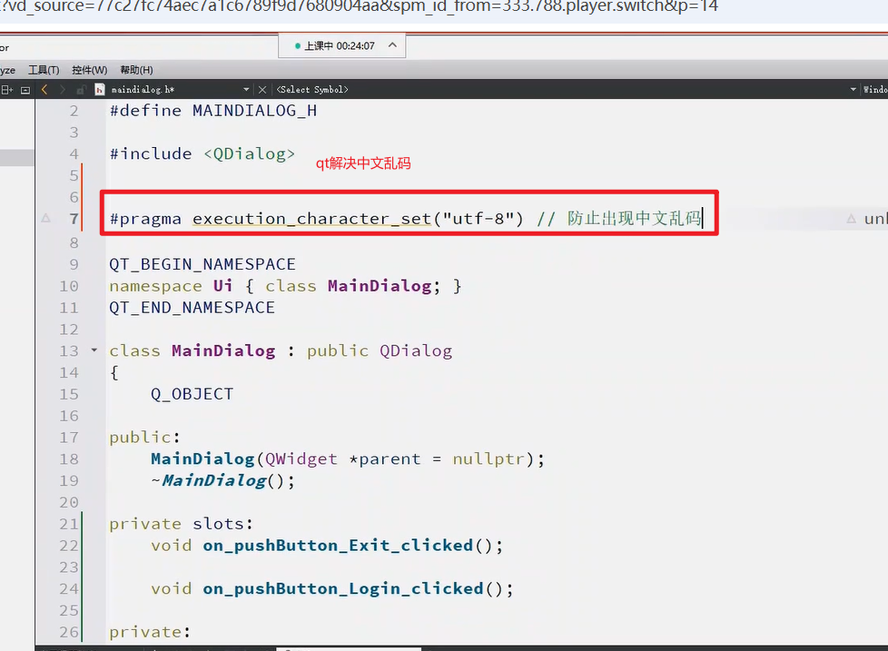

`#pragma execution_character_set("utf-8")` 是 **MSVC**（Microsoft Visual C++）编译器的一个预处理指令。它的主要作用是**指定程序编译后，可执行文件中的窄字符和窄字符串字面量的编码为 UTF-8**。 [[1](https://learn.microsoft.com/zh-tw/cpp/preprocessor/execution-character-set?view=msvc-170), [2](https://learn.microsoft.com/zh-cn/cpp/preprocessor/execution-character-set?view=msvc-170), [3](https://www.cnblogs.com/wainiwann/p/4766592.html)]

具体来说，它的核心作用和影响如下：

- **解决中文乱码：** 在 Windows 环境下使用 MSVC 编译器开发（如 Visual Studio 或 Qt Creator），源码中的中文字符常被默认识别为本地编码（如 GBK）。添加该指令后，编译器会将字符串以 UTF-8 编码存入二进制程序中。 [[1](https://blog.csdn.net/wanhuiba3269/article/details/150102430), [2](https://www.cnblogs.com/foohack/p/5206278.html)]
- **跨平台兼容：** 当代码需要在 Windows 和 Linux/macOS 上移植时，确保字符串统一采用 UTF-8 编码格式，避免不同平台间字符解析差异。
- **适用条件：** 它仅对 MSVC 编译器生效（主要在 VS 中使用）。对于 GCC 或 Clang 等编译器，处理 UTF-8 源码时通常不需要此指令。 [[1](https://blog.csdn.net/CSDN_RTKLIB/article/details/157425537), [2](https://www.cnblogs.com/wainiwann/p/4766592.html)]

在实际使用中，通常会结合条件编译，以确保代码的跨平台兼容性：

\#if _MSC_VER >= 1600
\#pragma execution_character_set("utf-8")
\#endif

### 验证用户输入

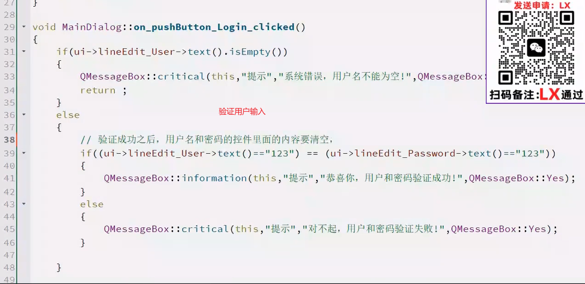

### 限制用户输入的最大长度

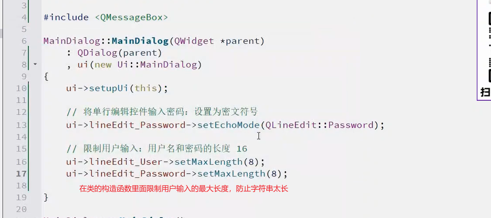

### 小技巧，用正则表达式来限定文本框就能够接收大小写字母和数字，避免一些奇奇怪怪的字符

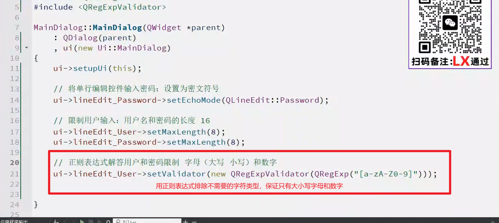

### 小技巧，应该先验证用户名，然后再验证密码

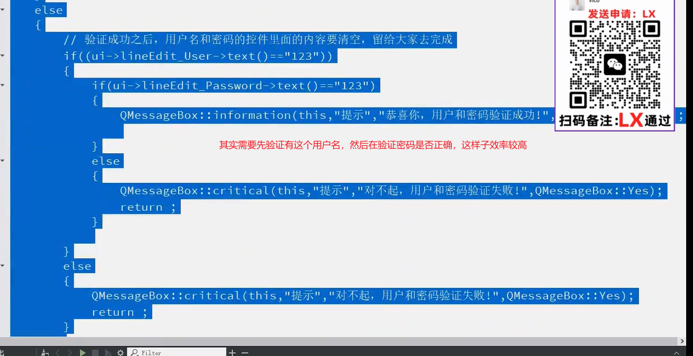

### 小技巧，把中文安全的转化为QString而不会有乱码

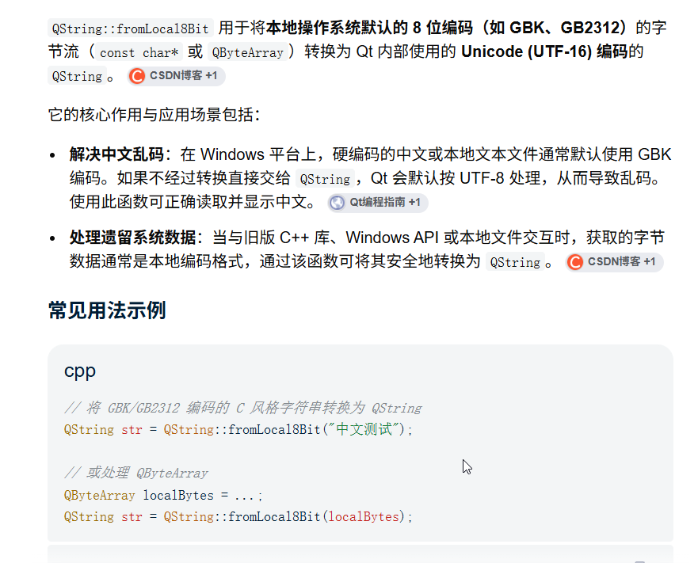

### 小技巧，把一个复选框改为有3种状态

在 Qt 中，只需将复选框（`QCheckBox`）的 **Tristate（三态）** 属性开启，即可在 未选中、半选中（未决状态） 和 选中 之间切换。 [[1](https://doc.qt.io/qt-6/zh/qcheckbox.html), [2](https://blog.csdn.net/qq_31165949/article/details/136676260)]

快速实现步骤

1. **开启三态属性**：调用 `setTristate(true)`。
2. **设置状态**：使用 `setCheckState()`，参数为 `Qt::CheckState` 枚举。
3. **获取状态**：使用 `checkState()` 获取当前状态。 [[1](https://zhuanlan.zhihu.com/p/473439130), [2](https://www.cnblogs.com/LyShark/p/17896591.html), [3](https://blog.csdn.net/qq_31165949/article/details/136676260)]

代码示例 (C++)

cpp

```
// 1. 开启三态模式
ui->checkBox->setTristate(true);

// 2. 设置复选框状态
ui->checkBox->setCheckState(Qt::PartiallyChecked); // 半选中
// ui->checkBox->setCheckState(Qt::Checked);       // 选中
// ui->checkBox->setCheckState(Qt::Unchecked);     // 未选中

// 3. 获取并判断复选框状态
Qt::CheckState state = ui->checkBox->checkState();
if (state == Qt::PartiallyChecked) {
    // 处理半选中状态
}
```

请谨慎使用此类代码。

状态枚举说明

对应的三种状态分别是： [[1](https://doc.qt.io/qt-6/zh/qcheckbox.html), [2](https://www.cnblogs.com/LyShark/p/17896591.html)]

- `Qt::Unchecked`：未选中（值为 0）
- `Qt::PartiallyChecked`：半选中/未决状态（值为 1）
- `Qt::Checked`：全选中（值为 2）

如果您使用 **Qt Quick (QML)** 开发，可以直接将属性 `tristate` 设为 `true`，并通过 `checkState` 属性来绑定和控制。

### 判断复选框的选中状态

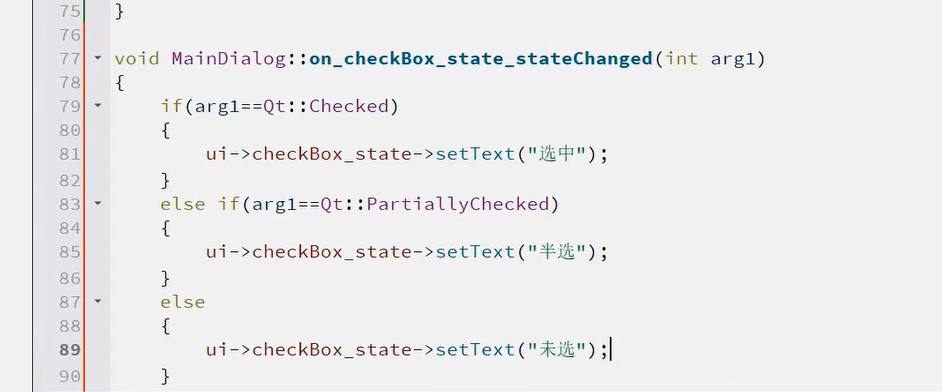