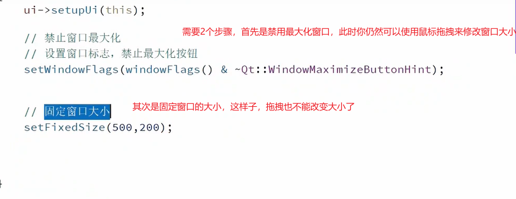
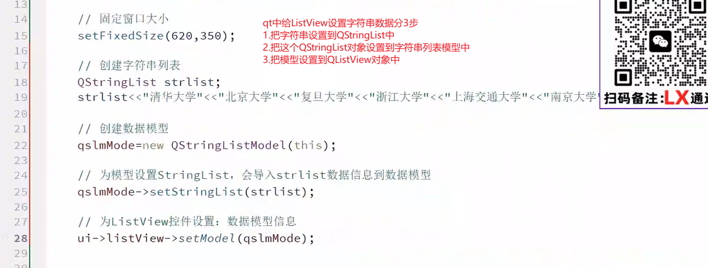
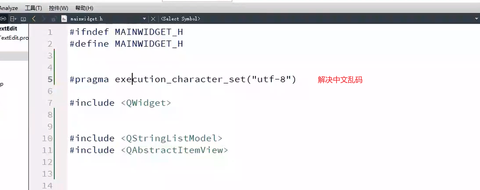
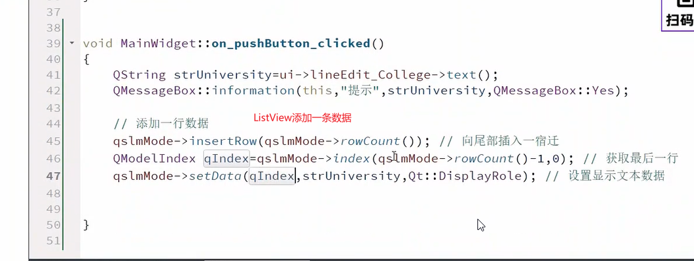

# 1.QListView控件实战应用

## 小技巧1，禁止窗口最大化

## 小技巧2 设置ListView的字符串数据

## 小技巧3，解决中文乱码，现在又更好的办法

### ListView添加一条数据

# 2.QPlainTextEdit控件实战应用

## 自己学习

# 3.QOpenGLWidget控件实战应用

## 自己学习

# 4.QGraphicView控件实战应用

## 自己学习

