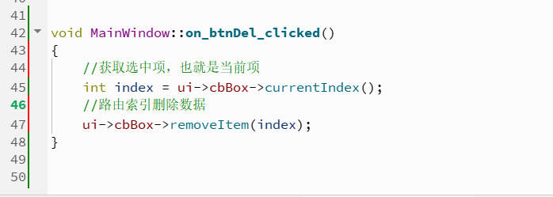
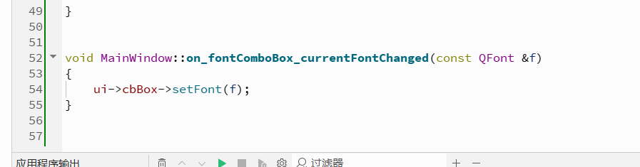

# 1.ComboBox和FontComboBox

## QComboBox的基本用法

###  1》添加项

### 2》删除项

### 3》修改数据使用setItemText(int index,const QString &text)

## FontComboBox的基本用法

### 这个字体下拉框很好用。可以很方便的选择字体，我们只需要处理他的currentFontChanged(QFont),在里面使用我们选中的字体即可

# 2.LineEdit和TextEdit

## 自己学习

# 3.PlainTextEdit和SpinBox

## 自己学习

# 4.DoubleSpinBox和TimeEdit

## 自己学习

# 5.DateEdit和DateTimeEdit和Dial

## 自己学习

# 6.HorizontalScrollBar和VerticalScrollBar

## 自己学习

# 7.HorizontalSlider和VerticalSlider

## 自己学习
